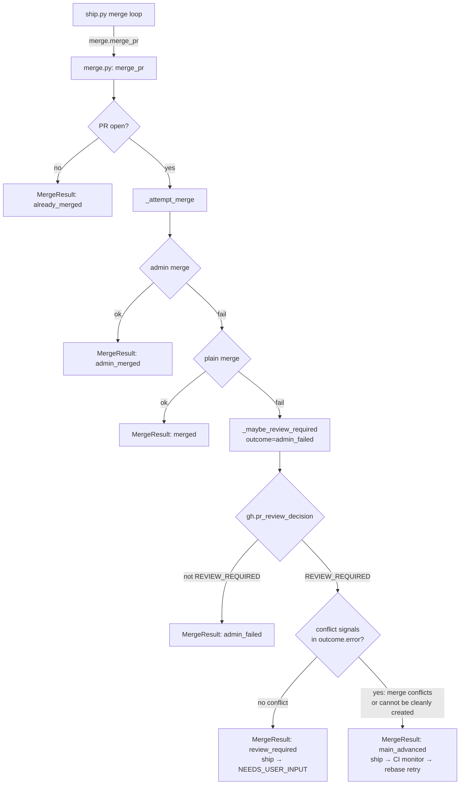

## Architecture Diagram

```mermaid
flowchart TD
    A[ship.py merge loop] -->|merge.merge_pr| B[merge.py: merge_pr]
    B --> C{PR open?}
    C -->|no| D[MergeResult: already_merged]
    C -->|yes| E[_attempt_merge]
    E --> F{admin merge}
    F -->|ok| G[MergeResult: admin_merged]
    F -->|fail| H{plain merge}
    H -->|ok| I[MergeResult: merged]
    H -->|fail| J[_maybe_review_required\noutcome=admin_failed]
    J --> K{gh.pr_review_decision}
    K -->|not REVIEW_REQUIRED| L[MergeResult: admin_failed]
    K -->|REVIEW_REQUIRED| M{conflict signals\nin outcome.error?}
    M -->|no conflict| N[MergeResult: review_required\nship → NEEDS_USER_INPUT]
    M -->|yes: merge conflicts\nor cannot be cleanly created| O[MergeResult: main_advanced\nship → CI monitor → rebase retry]
```
