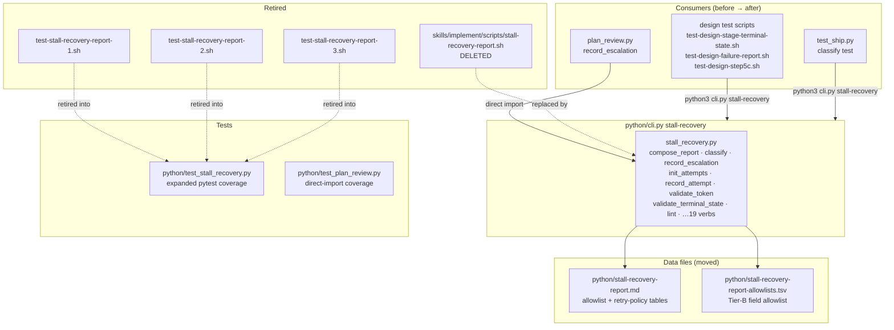

## Architecture Diagram

```mermaid
graph TD
    subgraph Consumers["Consumers (before → after)"]
        PR[plan_review.py<br/>record_escalation]
        DT[design test scripts<br/>test-design-stage-terminal-state.sh<br/>test-design-failure-report.sh<br/>test-design-step5c.sh]
        TS[test_ship.py<br/>classify test]
    end

    subgraph CLI["python/cli.py stall-recovery"]
        SR[stall_recovery.py<br/>compose_report · classify · record_escalation<br/>init_attempts · record_attempt · validate_token<br/>validate_terminal_state · lint · …19 verbs]
    end

    subgraph DataFiles["Data files (moved)"]
        MD[python/stall-recovery-report.md<br/>allowlist + retry-policy tables]
        TSV[python/stall-recovery-report-allowlists.tsv<br/>Tier-B field allowlist]
    end

    subgraph Retired["Retired"]
        SH[skills/implement/scripts/stall-recovery-report.sh<br/>DELETED]
        H1[test-stall-recovery-report-1.sh]
        H2[test-stall-recovery-report-2.sh]
        H3[test-stall-recovery-report-3.sh]
    end

    subgraph Tests["Tests"]
        PSR[python/test_stall_recovery.py<br/>expanded pytest coverage]
        PPR[python/test_plan_review.py<br/>direct-import coverage]
    end

    PR -->|direct import| SR
    DT -->|python3 cli.py stall-recovery| CLI
    TS -->|python3 cli.py stall-recovery| CLI
    SR --> MD
    SR --> TSV
    H1 -.->|retired into| PSR
    H2 -.->|retired into| PSR
    H3 -.->|retired into| PSR
    SH -.->|replaced by| SR
```
