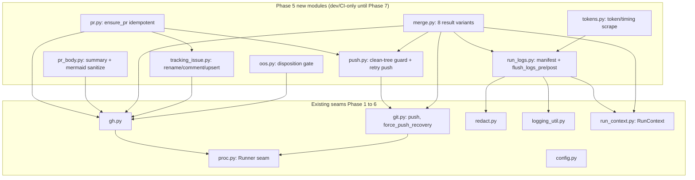

## Architecture Diagram

```mermaid
flowchart TD
  subgraph p5["Phase 5 new modules (dev/CI-only until Phase 7)"]
    run_logs["run_logs.py: manifest + flush_logs_pre/post"]
    tokens["tokens.py: token/timing scrape"]
    tracking_issue["tracking_issue.py: rename/comment/upsert"]
    pr_body["pr_body.py: summary + mermaid sanitize"]
    push["push.py: clean-tree guard + retry push"]
    pr["pr.py: ensure_pr idempotent"]
    oos["oos.py: disposition gate"]
    merge["merge.py: 8 result variants"]
  end

  subgraph seams["Existing seams Phase 1 to 6"]
    proc["proc.py: Runner seam"]
    gh["gh.py"]
    git["git.py: push, force_push_recovery"]
    redact["redact.py"]
    logging_util["logging_util.py"]
    run_context["run_context.py: RunContext"]
    config["config.py"]
  end

  pr --> push
  pr --> tracking_issue
  pr --> gh
  pr_body --> gh
  push --> git
  merge --> gh
  merge --> git
  merge --> push
  merge --> run_logs
  tokens --> run_logs
  tracking_issue --> gh
  run_logs --> redact
  run_logs --> logging_util
  oos --> gh

  gh --> proc
  git --> proc
  run_logs --> run_context
  merge --> run_context
```
