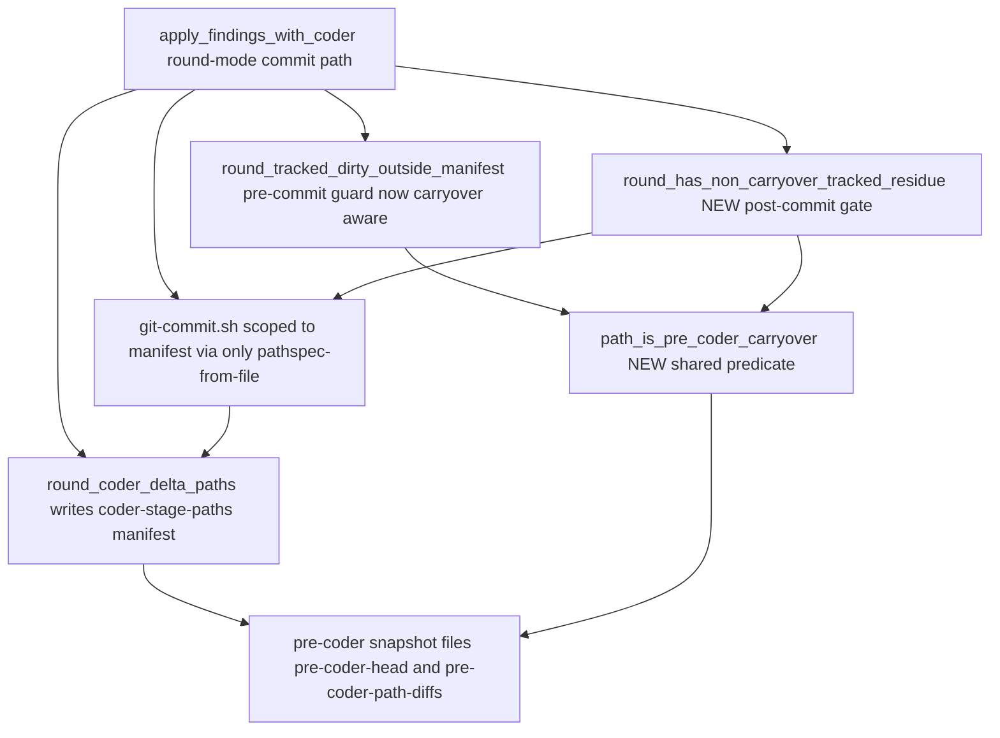

## Architecture Diagram

```mermaid
graph TD
    AFC["apply_findings_with_coder round-mode commit path"]
    SNAP["pre-coder snapshot files pre-coder-head and pre-coder-path-diffs"]
    MANIFEST["round_coder_delta_paths writes coder-stage-paths manifest"]
    CARRY["path_is_pre_coder_carryover NEW shared predicate"]
    GUARD["round_tracked_dirty_outside_manifest pre-commit guard now carryover aware"]
    RESIDUE["round_has_non_carryover_tracked_residue NEW post-commit gate"]
    COMMIT["git-commit.sh scoped to manifest via only pathspec-from-file"]

    AFC --> MANIFEST
    AFC --> GUARD
    AFC --> COMMIT
    AFC --> RESIDUE
    MANIFEST --> SNAP
    GUARD --> CARRY
    RESIDUE --> CARRY
    CARRY --> SNAP
    COMMIT --> MANIFEST
    RESIDUE --> COMMIT
```
