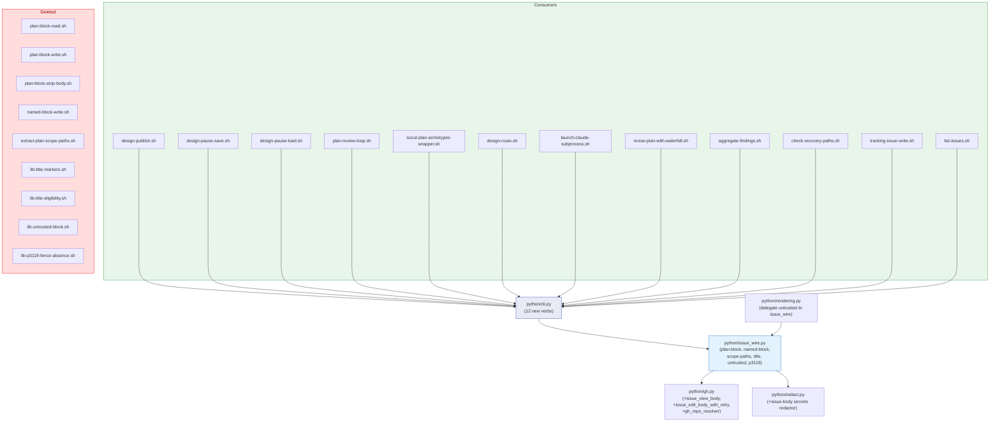

## Architecture Diagram

```mermaid
graph TD
    CLI["python/cli.py<br/>(12 new verbs)"]
    IW["python/issue_wire.py<br/>(plan-block, named-block,<br/>scope-paths, title, untrusted, p3119)"]
    GH["python/gh.py<br/>(+issue_view_body,<br/>+issue_edit_body_with_retry,<br/>+gh_repo_resolver)"]
    REDACT["python/redact.py<br/>(+issue-body secrets redactor)"]
    RENDER["python/rendering.py<br/>(delegate untrusted to issue_wire)"]

    CLI --> IW
    IW --> GH
    IW --> REDACT
    RENDER --> IW

    subgraph Consumers
        DP["design-publish.sh"]
        DPS["design-pause-save.sh"]
        DPL["design-pause-load.sh"]
        PRL["plan-review-loop.sh"]
        SAW["scout-plan-archetypes-wrapper.sh"]
        DR["design-route.sh"]
        LCS["launch-claude-subprocess.sh"]
        RPW["revise-plan-with-waterfall.sh"]
        AF["aggregate-findings.sh"]
        CRP["check-recovery-paths.sh"]
        TIW["tracking-issue-write.sh"]
        LI["list-issues.sh"]
    end

    DP --> CLI
    DPS --> CLI
    DPL --> CLI
    PRL --> CLI
    SAW --> CLI
    DR --> CLI
    LCS --> CLI
    RPW --> CLI
    AF --> CLI
    CRP --> CLI
    TIW --> CLI
    LI --> CLI

    subgraph Deleted
        PBR["plan-block-read.sh"]
        PBW["plan-block-write.sh"]
        PBS["plan-block-strip-body.sh"]
        NBW["named-block-write.sh"]
        EPSP["extract-plan-scope-paths.sh"]
        LTM["lib-title-markers.sh"]
        LTE["lib-title-eligibility.sh"]
        LUB["lib-untrusted-block.sh"]
        LP3["lib-p3119-fence-absence.sh"]
    end

    style Deleted fill:#fdd,stroke:#f00,color:#800
    style Consumers fill:#e8f5e9,stroke:#388e3c
    style IW fill:#e3f2fd,stroke:#1976d2
    style CLI fill:#e8eaf6,stroke:#3949ab
```
