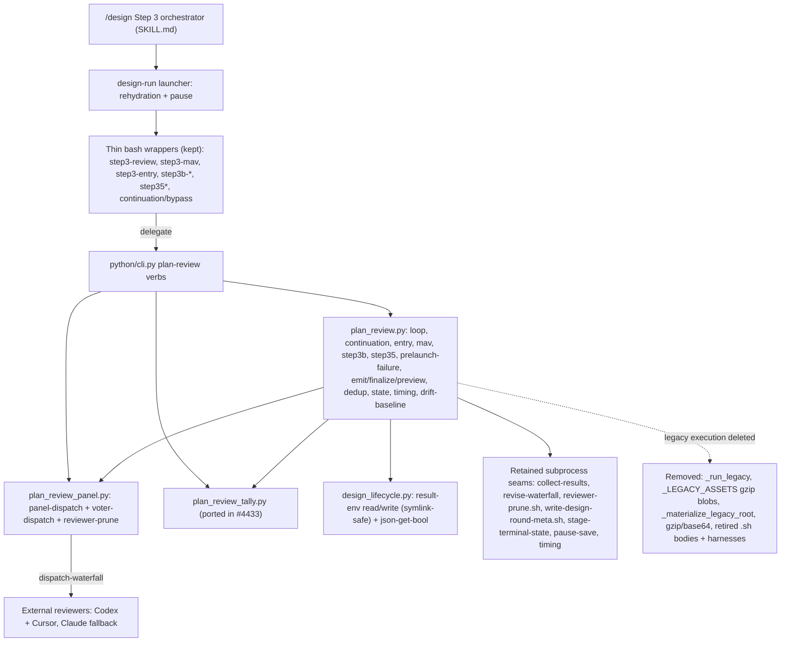

## Architecture Diagram

```mermaid
graph TD
    SKILL["/design Step 3 orchestrator (SKILL.md)"]
    LAUNCH["design-run launcher: rehydration + pause"]
    WRAP["Thin bash wrappers (kept): step3-review, step3-mav, step3-entry, step3b-*, step35*, continuation/bypass"]
    CLI["python/cli.py plan-review verbs"]
    PR["plan_review.py: loop, continuation, entry, mav, step3b, step35, prelaunch-failure, emit/finalize/preview, dedup, state, timing, drift-baseline"]
    PANEL["plan_review_panel.py: panel-dispatch + voter-dispatch + reviewer-prune"]
    TALLY["plan_review_tally.py (ported in #4433)"]
    LIFE["design_lifecycle.py: result-env read/write (symlink-safe) + json-get-bool"]
    SUB["Retained subprocess seams: collect-results, revise-waterfall, reviewer-prune.sh, write-design-round-meta.sh, stage-terminal-state, pause-save, timing"]
    EXT["External reviewers: Codex + Cursor, Claude fallback"]
    GONE["Removed: _run_legacy, _LEGACY_ASSETS gzip blobs, _materialize_legacy_root, gzip/base64, retired .sh bodies + harnesses"]

    SKILL --> LAUNCH
    LAUNCH --> WRAP
    WRAP -->|delegate| CLI
    CLI --> PR
    CLI --> PANEL
    CLI --> TALLY
    PR --> PANEL
    PR --> TALLY
    PR --> LIFE
    PR --> SUB
    PANEL -->|dispatch-waterfall| EXT
    PR -.->|legacy execution deleted| GONE
```
