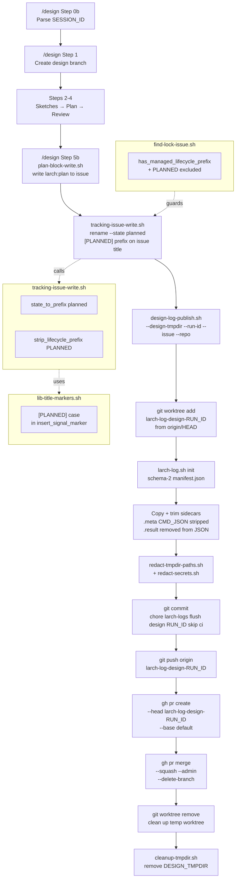

## Architecture Diagram

```mermaid
flowchart TD
    A["/design Step 0b\nParse SESSION_ID"] --> B["/design Step 1\nCreate design branch"]
    B --> C["Steps 2-4\nSketches → Plan → Review"]
    C --> D["/design Step 5b\nplan-block-write.sh\nwrite larch:plan to issue"]
    D --> E["tracking-issue-write.sh\nrename --state planned\n[PLANNED] prefix on issue title"]
    E --> F["design-log-publish.sh\n--design-tmpdir --run-id --issue --repo"]
    
    F --> G["git worktree add\nlarch-log-design-RUN_ID\nfrom origin/HEAD"]
    G --> H["larch-log.sh init\nschema-2 manifest.json"]
    H --> I["Copy + trim sidecars\n.meta CMD_JSON stripped\n.result removed from JSON"]
    I --> J["redact-tmpdir-paths.sh\n+ redact-secrets.sh"]
    J --> K["git commit\nchore larch-logs flush design RUN_ID skip ci"]
    K --> L["git push origin\nlarch-log-design-RUN_ID"]
    L --> M["gh pr create\n--head larch-log-design-RUN_ID\n--base default"]
    M --> N["gh pr merge\n--squash --admin\n--delete-branch"]
    N --> O["git worktree remove\nclean up temp worktree"]
    O --> P["cleanup-tmpdir.sh\nremove DESIGN_TMPDIR"]

    subgraph lib-title-markers["lib-title-markers.sh"]
        direction LR
        TM1["[PLANNED] case\nin insert_signal_marker"]
    end
    subgraph tiw["tracking-issue-write.sh"]
        direction LR
        TW1["state_to_prefix planned"]
        TW2["strip_lifecycle_prefix PLANNED"]
    end
    subgraph fli["find-lock-issue.sh"]
        direction LR
        FL1["has_managed_lifecycle_prefix\n+ PLANNED excluded"]
    end
    E -.->|calls| tiw
    tiw -.->|uses| lib-title-markers
    fli -.->|guards| E
```
