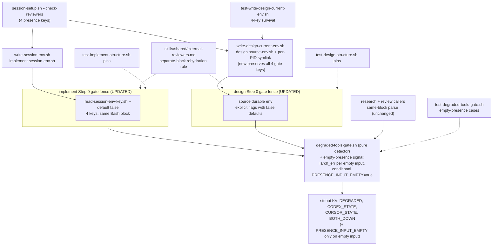

## Architecture Diagram

```mermaid
graph TD
    SS["session-setup.sh --check-reviewers<br/>(4 presence keys)"] --> WSE["write-session-env.sh<br/>implement session-env.sh"]
    SS --> WDE["write-design-current-env.sh<br/>design source-env.sh + per-PID symlink<br/>(now preserves all 4 gate keys)"]

    subgraph IMPL["implement Step 0 gate fence (UPDATED)"]
        RSEK["read-session-env-key.sh --default false<br/>4 keys, same Bash block"]
    end
    subgraph DSGN["design Step 0 gate fence (UPDATED)"]
        SRC["source durable env<br/>explicit flags with false defaults"]
    end

    WSE --> RSEK
    WDE --> SRC

    RSEK --> GATE
    SRC --> GATE
    RR["research + review callers<br/>same-block parse (unchanged)"] --> GATE

    GATE["degraded-tools-gate.sh (pure detector)<br/>+ empty-presence signal:<br/>larch_err per empty input,<br/>conditional PRESENCE_INPUT_EMPTY=true"]

    GATE --> OUT["stdout KV: DEGRADED, CODEX_STATE,<br/>CURSOR_STATE, BOTH_DOWN<br/>(+ PRESENCE_INPUT_EMPTY only on empty input)"]

    DOC["skills/shared/external-reviewers.md<br/>separate-block rehydration rule"] -.-> IMPL
    DOC -.-> DSGN

    T1["test-degraded-tools-gate.sh<br/>empty-presence cases"] -.-> GATE
    T2["test-implement-structure.sh pins"] -.-> IMPL
    T3["test-design-structure.sh pins"] -.-> DSGN
    T4["test-write-design-current-env.sh<br/>4-key survival"] -.-> WDE
```
