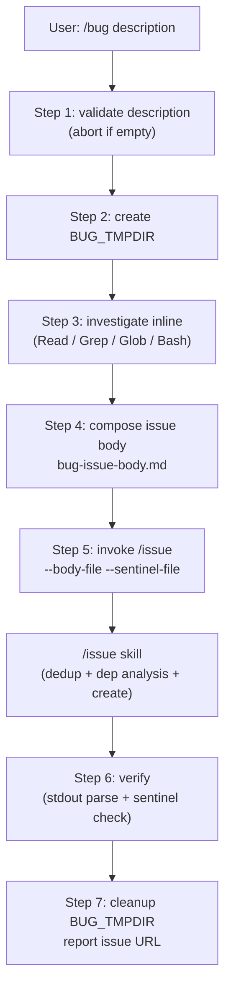

## Architecture Diagram

```mermaid
flowchart TD
    A["User: /bug description"] --> B["Step 1: validate description\n(abort if empty)"]
    B --> C["Step 2: create BUG_TMPDIR"]
    C --> D["Step 3: investigate inline\n(Read / Grep / Glob / Bash)"]
    D --> E["Step 4: compose issue body\nbug-issue-body.md"]
    E --> F["Step 5: invoke /issue\n--body-file --sentinel-file"]
    F --> G["/issue skill\n(dedup + dep analysis + create)"]
    G --> H["Step 6: verify\n(stdout parse + sentinel check)"]
    H --> I["Step 7: cleanup BUG_TMPDIR\nreport issue URL"]
```
