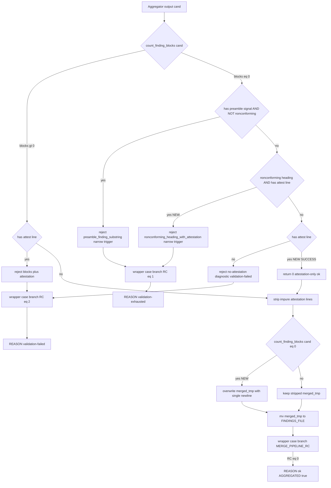

## Architecture Diagram

```mermaid
flowchart TD
  Input[Aggregator output cand] --> CountBlocks{count_finding_blocks cand}
  CountBlocks -->|blocks gt 0| EarlyAttest{has attest line}
  EarlyAttest -->|yes| RejBlocksAttest[reject blocks plus attestation]
  EarlyAttest -->|no| StripPath[strip impure attestation lines]
  CountBlocks -->|blocks eq 0| Branch1{has preamble signal AND NOT nonconforming}
  Branch1 -->|yes| RejPreamble[reject preamble_finding_substring narrow trigger]
  Branch1 -->|no| Branch2{nonconforming heading AND has attest line}
  Branch2 -->|yes NEW| RejNonconf[reject nonconforming_heading_with_attestation narrow trigger]
  Branch2 -->|no| Branch3{has attest line}
  Branch3 -->|no| RejNoAttest[reject no-attestation diagnostic validation-failed]
  Branch3 -->|yes NEW SUCCESS| RetOK[return 0 attestation-only ok]
  RetOK --> StripPath
  StripPath --> ForceWS{count_finding_blocks cand eq 0}
  ForceWS -->|yes NEW| OverwriteWS[overwrite merged_tmp with single newline]
  ForceWS -->|no| KeepStripped[keep stripped merged_tmp]
  OverwriteWS --> Persist[mv merged_tmp to FINDINGS_FILE]
  KeepStripped --> Persist
  Persist --> Wrapper[wrapper case branch MERGE_PIPELINE_RC]
  Wrapper -->|RC eq 0| EmitOK[REASON ok AGGREGATED true]
  RejPreamble --> Wrapper1[wrapper case branch RC eq 1]
  RejNonconf --> Wrapper1
  Wrapper1 --> EmitExhaust[REASON validation-exhausted]
  RejNoAttest --> Wrapper2[wrapper case branch RC eq 2]
  RejBlocksAttest --> Wrapper2
  Wrapper2 --> EmitFailed[REASON validation-failed]
```
