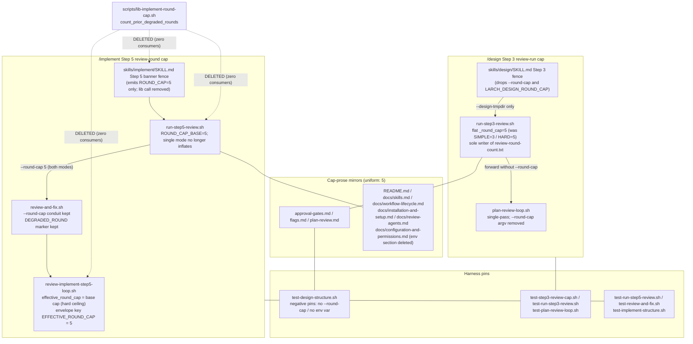

## Architecture Diagram

```mermaid
graph TD
    subgraph DESIGN["/design Step 3 review-run cap"]
        SKILL_D["skills/design/SKILL.md Step 3 fence<br/>(drops --round-cap and LARCH_DESIGN_ROUND_CAP)"]
        RS3["run-step3-review.sh<br/>flat _round_cap=5 (was SIMPLE=3 / HARD=5)<br/>sole writer of review-round-count.txt"]
        PRL["plan-review-loop.sh<br/>single-pass; --round-cap argv removed"]
        SKILL_D -->|"--design-tmpdir only"| RS3
        RS3 -->|"forward without --round-cap"| PRL
    end

    subgraph IMPLEMENT["/implement Step 5 review-round cap"]
        SKILL_I["skills/implement/SKILL.md Step 5 banner fence<br/>(emits ROUND_CAP=5 only; lib call removed)"]
        RS5["run-step5-review.sh<br/>ROUND_CAP_BASE=5; single mode no longer inflates"]
        RAF["review-and-fix.sh<br/>--round-cap conduit kept<br/>DEGRADED_ROUND marker kept"]
        LOOP["review-implement-step5-loop.sh<br/>effective_round_cap = base cap (hard ceiling)<br/>envelope key EFFECTIVE_ROUND_CAP = 5"]
        SKILL_I --> RS5
        RS5 -->|"--round-cap 5 (both modes)"| RAF
        RAF --> LOOP
    end

    LIB["scripts/lib-implement-round-cap.sh<br/>count_prior_degraded_rounds"]
    LIB -. "DELETED (zero consumers)" .-> RS5
    LIB -. "DELETED (zero consumers)" .-> LOOP
    LIB -. "DELETED (zero consumers)" .-> SKILL_I

    subgraph DOCS["Cap-prose mirrors (uniform: 5)"]
        D1["approval-gates.md / flags.md / plan-review.md"]
        D2["README.md / docs/skills.md / docs/workflow-lifecycle.md<br/>docs/installation-and-setup.md / docs/review-agents.md<br/>docs/configuration-and-permissions.md (env section deleted)"]
    end

    subgraph TESTS["Harness pins"]
        T1["test-design-structure.sh<br/>negative pins: no --round-cap / no env var"]
        T2["test-step3-review-cap.sh / test-run-step3-review.sh<br/>test-plan-review-loop.sh"]
        T3["test-run-step5-review.sh / test-review-and-fix.sh<br/>test-implement-structure.sh"]
    end

    RS3 --- D1
    RS5 --- D2
    DESIGN --- T2
    IMPLEMENT --- T3
    D1 --- T1
```
