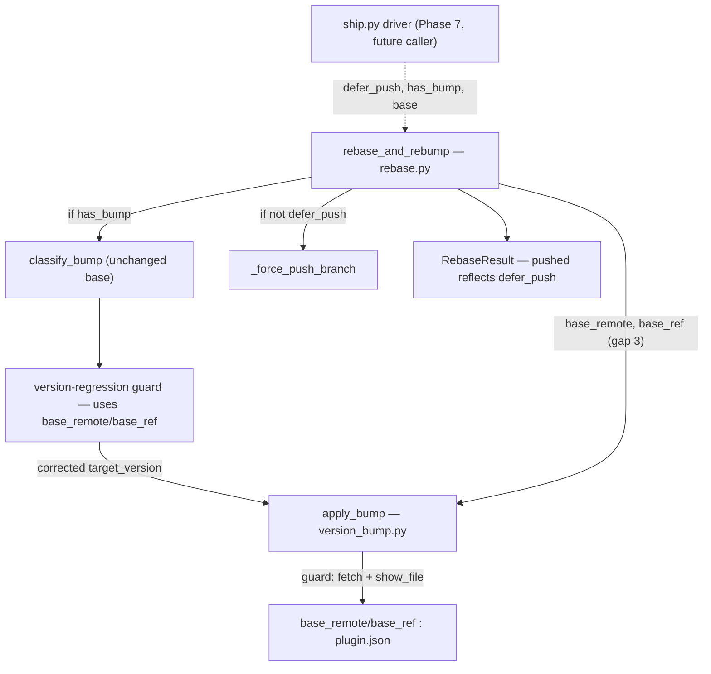

## Architecture Diagram

```mermaid
graph TD
    Driver["ship.py driver (Phase 7, future caller)"]
    RR["rebase_and_rebump — rebase.py"]
    CLS["classify_bump (unchanged base)"]
    GUARD["version-regression guard — uses base_remote/base_ref"]
    AB["apply_bump — version_bump.py"]
    BASE["base_remote/base_ref : plugin.json"]
    PUSH["_force_push_branch"]
    RESULT["RebaseResult — pushed reflects defer_push"]

    Driver -.->|"defer_push, has_bump, base"| RR
    RR -->|"if has_bump"| CLS
    CLS --> GUARD
    GUARD -->|"corrected target_version"| AB
    RR -->|"base_remote, base_ref (gap 3)"| AB
    AB -->|"guard: fetch + show_file"| BASE
    RR -->|"if not defer_push"| PUSH
    RR --> RESULT
```
