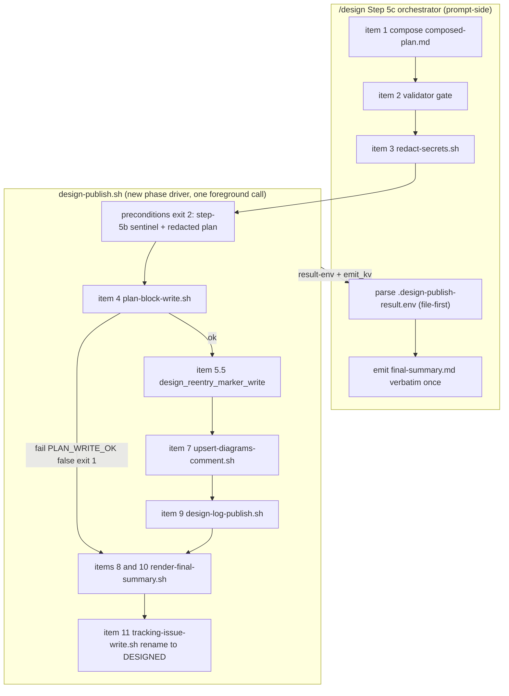

## Architecture Diagram

```mermaid
graph TD
    subgraph ORCH["/design Step 5c orchestrator (prompt-side)"]
        C1["item 1 compose composed-plan.md"]
        C2["item 2 validator gate"]
        C3["item 3 redact-secrets.sh"]
        PARSE["parse .design-publish-result.env (file-first)"]
        EMIT["emit final-summary.md verbatim once"]
    end

    subgraph DRV["design-publish.sh (new phase driver, one foreground call)"]
        PRE["preconditions exit 2: step-5b sentinel + redacted plan"]
        PW["item 4 plan-block-write.sh"]
        MK["item 5.5 design_reentry_marker_write"]
        UP["item 7 upsert-diagrams-comment.sh"]
        PUB["item 9 design-log-publish.sh"]
        SUM["items 8 and 10 render-final-summary.sh"]
        REN["item 11 tracking-issue-write.sh rename to DESIGNED"]
    end

    C1 --> C2 --> C3 --> PRE
    PRE --> PW
    PW -->|fail PLAN_WRITE_OK false exit 1| SUM
    PW -->|ok| MK --> UP --> PUB --> SUM
    SUM --> REN
    DRV -->|result-env + emit_kv| PARSE --> EMIT
```
