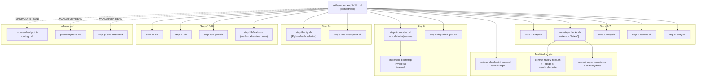

## Architecture Diagram

```mermaid
graph TD
    SKILL["skills/implement/SKILL.md<br/>(orchestrator)"]

    subgraph "Step 0"
        S0B["step-0-bootstrap.sh<br/>--mode initial|resume"]
        S0G["step-0-degraded-gate.sh"]
        S0B --> BInv["implement-bootstrap-invoke.sh<br/>(internal)"]
    end

    subgraph "Steps 2-7"
        S2["step-2-entry.sh"]
        CHK["run-step-checks.sh<br/>--site step3|step6|..."]
        S5E["step-5-entry.sh"]
        S5R["step-5-resume.sh"]
        S6["step-6-entry.sh"]
    end

    subgraph "Step 8+"
        S8["step-8-ship.sh<br/>(Python/bash selector)"]
        S8OOS["step-8-oos-checkpoint.sh"]
    end

    subgraph "Steps 16-18"
        S16["step-16.sh"]
        S17["step-17.sh"]
        S18A["step-18a-gate.sh"]
        S18F["step-18-finalize.sh<br/>(marks-before-teardown)"]
    end

    subgraph "references/"
        R1["rebase-checkpoint-routing.md"]
        R2["phantom-probe.md"]
        R3["ship-pr-exit-matrix.md"]
    end

    subgraph "Modified scripts"
        RCP["rebase-checkpoint-probe.sh<br/>+ --forked-target"]
        CRF["commit-review-fixes.sh<br/>+ --stage-all<br/>+ self-rehydrate"]
        CIM["commit-implementation.sh<br/>+ self-rehydrate"]
    end

    SKILL --> S0B
    SKILL --> S0G
    SKILL --> S2
    SKILL --> CHK
    SKILL --> S5E
    SKILL --> S5R
    SKILL --> S6
    SKILL --> RCP
    SKILL --> S8
    SKILL --> S8OOS
    SKILL --> S16
    SKILL --> S17
    SKILL --> S18A
    SKILL --> S18F

    SKILL -. "MANDATORY READ" .-> R1
    SKILL -. "MANDATORY READ" .-> R2
    SKILL -. "MANDATORY READ" .-> R3

    CHK --> CIM
    CHK --> CRF
```
