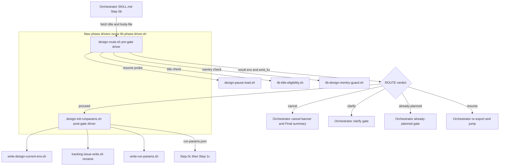

## Architecture Diagram

```mermaid
flowchart TD
    ORCH[Orchestrator SKILL.md Step 0b]
    ROUTE[design-route.sh pre-gate driver]
    INIT[design-init-runparams.sh post-gate driver]
    VERDICT{ROUTE verdict}

    ORCH -->|fetch title and body-file| ROUTE
    ROUTE -->|resume probe| PAUSE[design-pause-load.sh]
    ROUTE -->|title check| TITLE[lib-title-eligibility.sh]
    ROUTE -->|reentry check| REENTRY[lib-design-reentry-guard.sh]
    ROUTE -->|result env and emit_kv| VERDICT

    VERDICT -->|cancel| CANCEL[Orchestrator cancel banner and Final summary]
    VERDICT -->|clarify| CLARIFY[Orchestrator clarify gate]
    VERDICT -->|already-planned| PLANNED[Orchestrator already-planned gate]
    VERDICT -->|resume| RESUME[Orchestrator re-export and jump]
    VERDICT -->|proceed| INIT

    INIT --> WDCE[write-design-current-env.sh]
    INIT --> TIW[tracking-issue-write.sh rename]
    INIT --> WRP[write-run-params.sh]
    INIT -->|run-params.json| NEXT[Step 0c then Step 1c]

    subgraph drivers[New phase drivers reuse lib-phase-driver.sh]
        ROUTE
        INIT
    end
```
