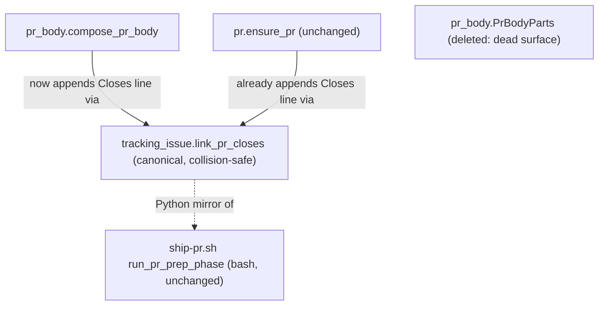

## Architecture Diagram

```mermaid
graph TD
    compose["pr_body.compose_pr_body"]
    ensure["pr.ensure_pr (unchanged)"]
    helper["tracking_issue.link_pr_closes (canonical, collision-safe)"]
    bash["ship-pr.sh run_pr_prep_phase (bash, unchanged)"]
    dead["pr_body.PrBodyParts (deleted: dead surface)"]
    compose -->|now appends Closes line via| helper
    ensure -->|already appends Closes line via| helper
    helper -.->|Python mirror of| bash
```
