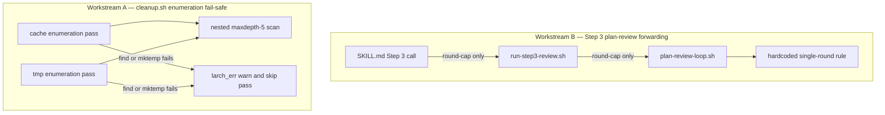

## Architecture Diagram

```mermaid
graph TD
  subgraph S3["Workstream B — Step 3 plan-review forwarding"]
    SKILL["SKILL.md Step 3 call"]
    DRV["run-step3-review.sh"]
    LOOP["plan-review-loop.sh"]
    CONV["hardcoded single-round rule"]
    SKILL -->|round-cap only| DRV
    DRV -->|round-cap only| LOOP
    LOOP --> CONV
  end
  subgraph CL["Workstream A — cleanup.sh enumeration fail-safe"]
    CACHE["cache enumeration pass"]
    TMP["tmp enumeration pass"]
    SCAN["nested maxdepth-5 scan"]
    WARN["larch_err warn and skip pass"]
    CACHE --> SCAN
    TMP --> SCAN
    CACHE -->|find or mktemp fails| WARN
    TMP -->|find or mktemp fails| WARN
  end
```
