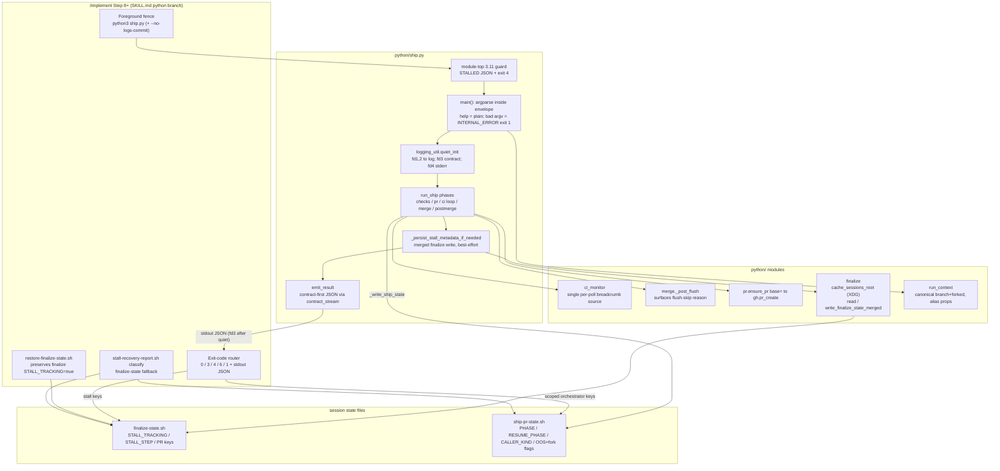

## Architecture Diagram

```mermaid
flowchart TD
    subgraph orch["/implement Step 8+ (SKILL.md python branch)"]
        FENCE["Foreground fence<br/>python3 ship.py (+ --no-logs-commit)"]
        ROUTE["Exit-code router<br/>0 / 3 / 4 / 6 / 1 + stdout JSON"]
        RESTORE["restore-finalize-state.sh<br/>preserves finalize STALL_TRACKING=true"]
        CLASSIFY["stall-recovery-report.sh classify<br/>finalize-state fallback"]
    end

    subgraph driver["python/ship.py"]
        GUARD["module-top 3.11 guard<br/>STALLED JSON + exit 4"]
        MAIN["main(): argparse inside envelope<br/>help = plain; bad argv = INTERNAL_ERROR exit 1"]
        QUIET["logging_util.quiet_init<br/>fd1,2 to log; fd3 contract; fd4 stderr"]
        RUN["run_ship phases<br/>checks / pr / ci loop / merge / postmerge"]
        GAPFILL["_persist_stall_metadata_if_needed<br/>merged finalize write, best-effort"]
        EMIT["emit_result<br/>contract-first JSON via contract_stream"]
    end

    subgraph modules["python/ modules"]
        CIMON["ci_monitor<br/>single per-poll breadcrumb source"]
        MERGE["merge._post_flush<br/>surfaces flush-skip reason"]
        PR["pr.ensure_pr base= to gh.pr_create"]
        FIN["finalize<br/>cache_sessions_root (XDG)<br/>read / write_finalize_state_merged"]
        RC["run_context<br/>canonical branch+forked, alias props"]
    end

    subgraph state["session state files"]
        FSTATE["finalize-state.sh<br/>STALL_TRACKING / STALL_STEP / PR keys"]
        SSTATE["ship-pr-state.sh<br/>PHASE / RESUME_PHASE / CALLER_KIND / OOS+fork flags"]
    end

    FENCE --> GUARD --> MAIN --> QUIET --> RUN --> GAPFILL --> EMIT
    EMIT -->|"stdout JSON (fd3 after quiet)"| ROUTE
    MAIN --> RC
    RUN --> CIMON
    RUN --> MERGE
    RUN --> PR
    GAPFILL --> FIN
    FIN --> FSTATE
    RUN -->|"_write_ship_state"| SSTATE
    ROUTE -->|"stall keys"| FSTATE
    ROUTE -->|"scoped orchestrator keys"| SSTATE
    RESTORE --> FSTATE
    CLASSIFY --> FSTATE
    CLASSIFY --> SSTATE
```
