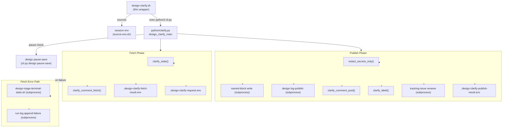

## Architecture Diagram

```mermaid
graph TD
    W["design-clarify.sh<br/>(thin wrapper)"]
    PY["python/clarify.py<br/>design_clarify_main"]
    ENV["session env<br/>(source-env.sh)"]
    PAUSE["design pause-save<br/>(cli.py design pause-save)"]

    subgraph FetchPhase["Fetch Phase"]
        FS["clarify_state()"]
        FC["clarify_comment_fetch()"]
        FRE[".design-clarify-fetch-result.env"]
        RRE[".design-clarify-request.env"]
    end

    subgraph PublishPhase["Publish Phase"]
        RD["redact_secrets_only()"]
        NB["named-block write (subprocess)"]
        LP["design log-publish (subprocess)"]
        CP["clarify_comment_post()"]
        CL["clarify_label()"]
        RN["tracking-issue rename (subprocess)"]
        PRE[".design-clarify-publish-result.env"]
    end

    subgraph ErrorHandling["Fetch Error Path"]
        ST["design-stage-terminal-state.sh (subprocess)"]
        AF["run-log append-failure (subprocess)"]
    end

    W -->|"sources"| ENV
    W -->|"exec python3 cli.py"| PY
    PY -->|"pause check"| PAUSE
    PY --> FetchPhase
    PY --> PublishPhase
    FetchPhase --> FS
    FetchPhase --> FC
    FetchPhase --> FRE
    FetchPhase --> RRE
    PublishPhase --> RD
    PublishPhase --> NB
    PublishPhase --> LP
    PublishPhase --> CP
    PublishPhase --> CL
    PublishPhase --> RN
    PublishPhase --> PRE
    FetchPhase -->|"on failure"| ErrorHandling
    ErrorHandling --> ST
    ErrorHandling --> AF
```
