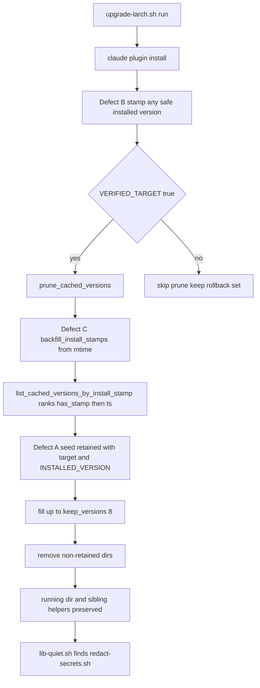

## Architecture Diagram

```mermaid
graph TD
    Entry[upgrade-larch.sh run] --> Install[claude plugin install]
    Install --> StampB[Defect B stamp any safe installed version]
    StampB --> Gate{VERIFIED_TARGET true}
    Gate -->|yes| Prune[prune_cached_versions]
    Gate -->|no| Skip[skip prune keep rollback set]
    Prune --> Backfill[Defect C backfill_install_stamps from mtime]
    Backfill --> Rank[list_cached_versions_by_install_stamp ranks has_stamp then ts]
    Rank --> Seed[Defect A seed retained with target and INSTALLED_VERSION]
    Seed --> Cap[fill up to keep_versions 8]
    Cap --> Evict[remove non-retained dirs]
    Evict --> Safe[running dir and sibling helpers preserved]
    Safe --> Redact[lib-quiet.sh finds redact-secrets.sh]
```
