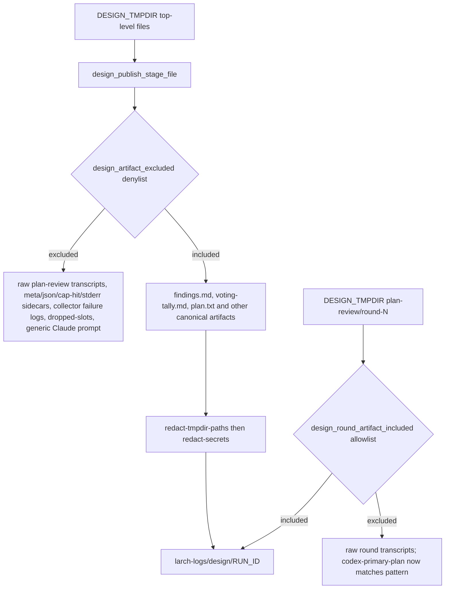

## Architecture Diagram

```mermaid
graph TD
    SRC["DESIGN_TMPDIR top-level files"] --> STAGE["design_publish_stage_file"]
    STAGE --> GATE{"design_artifact_excluded denylist"}
    GATE -->|excluded| DROP["raw plan-review transcripts, meta/json/cap-hit/stderr sidecars, collector failure logs, dropped-slots, generic Claude prompt"]
    GATE -->|included| CANON["findings.md, voting-tally.md, plan.txt and other canonical artifacts"]
    CANON --> REDACT["redact-tmpdir-paths then redact-secrets"]
    REDACT --> OUT["larch-logs/design/RUN_ID"]
    PRSRC["DESIGN_TMPDIR plan-review/round-N"] --> RGATE{"design_round_artifact_included allowlist"}
    RGATE -->|excluded| RDROP["raw round transcripts; codex-primary-plan now matches pattern"]
    RGATE -->|included| OUT
```
