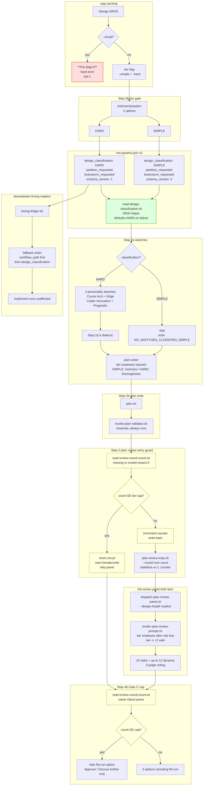

## Architecture Diagram

```mermaid
flowchart TD
  subgraph argv["argv parsing"]
    A0["/design ARGS"] --> A1{"--trivial?"}
    A1 -- "yes" --> A2["**Pre-Step-0**<br/>hard error<br/>exit 1"]
    A1 -- "no" --> A3["tier flag<br/>--simple / --hard"]
  end

  subgraph tier_gate["Step 0b tier gate"]
    A3 --> B0["AskUserQuestion<br/>2 options"]
    B0 --> B1["SIMPLE"]
    B0 --> B2["HARD"]
  end

  subgraph runparams["run-params.json v2"]
    B1 --> C1["design_classification: SIMPLE<br/>partition_requested<br/>brainstorm_requested<br/>schema_version: 2"]
    B2 --> C2["design_classification: HARD<br/>partition_requested<br/>brainstorm_requested<br/>schema_version: 2"]
    C1 --> CR["read-design-classification.sh<br/>NEW helper<br/>defaults HARD on failure"]
    C2 --> CR
  end

  subgraph step2a["Step 2a sketches"]
    CR --> D1{"classification?"}
    D1 -- "SIMPLE" --> D2["skip<br/>write NO_SKETCHES_CLASSIFIED_SIMPLE"]
    D1 -- "HARD" --> D3["4 personality sketches<br/>Cursor Arch + Edge<br/>Codex Innovation + Pragmatic"]
    D3 --> D4["Step 2a.5 dialectic"]
    D2 --> E0
    D4 --> E0
  end

  subgraph step2b["Step 2b plan write"]
    E0["plan-writer<br/>tier emphasis injected<br/>SIMPLE: minimize / HARD: thoroughness"] --> E1["plan.txt"]
    E1 --> E2["invoke-plan-validator.sh<br/>renamed, always runs"]
  end

  subgraph step3["Step 3 plan review entry guard"]
    E2 --> F0["read review-round-count.txt<br/>missing or invalid means 0"]
    F0 --> F1{"count GE tier-cap?"}
    F1 -- "yes" --> F2["short-circuit<br/>warn breadcrumb<br/>skip panel"]
    F1 -- "no" --> F3["increment counter<br/>write back"]
    F3 --> F4["plan-review-loop.sh<br/>--round-num count<br/>stateless w.r.t. counter"]
  end

  subgraph review["full review panel both tiers"]
    F4 --> G0["dispatch-plan-review-panel.sh<br/>--design-tmpdir explicit"]
    G0 --> G1["render-plan-review-prompt.sh<br/>tier emphasis after role line<br/>tail -n +2 safe"]
    G1 --> G2["10 static + up to 12 dynamic<br/>3-judge voting"]
  end

  subgraph gateC["Step 4b Gate C cap"]
    G2 --> H0["read review-round-count.txt<br/>same robust parse"]
    H0 --> H1{"count GE cap?"}
    H1 -- "yes" --> H2["hide Re-run option<br/>Approve / Discuss further only"]
    H1 -- "no" --> H3["3 options including Re-run"]
    F2 --> H0
  end

  subgraph timing["downstream timing readers"]
    C2 --> T0["timing-ledger.sh"]
    T0 --> T1["fallback chain<br/>workflow_path first<br/>then design_classification"]
    T1 --> T2["implement runs unaffected"]
  end

  classDef removed fill:#fdd,stroke:#900
  classDef new fill:#dfd,stroke:#090
  classDef changed fill:#ffd,stroke:#990
  class A2 removed
  class CR new
  class F0,F1,F2,F3,H0,H1 changed
```
