## Architecture Diagram

```mermaid
graph TD
    subgraph SKILL["skills/design/SKILL.md (orchestrator)"]
        FENCE0["Step 0 fence\ndesign-step0.sh --phase initial|resume-*"]
        FENCE0C["Step 0c fence\ndesign-step0c.sh"]
        FENCE1D5["Step 1d.5 fence\ndesign-step1d5.sh --mode entry|complete"]
        FENCE1D7["Step 1d.7 fence\ndesign-step1d7.sh"]
        FENCE1E["Gate B/C reentry fence\ndesign-step1e-reentry.sh"]
        FENCE2A["Step 2a fence\ndesign-step2a.sh"]
        FENCE2A5["Step 2a.5 fence\ndesign-step2a5.sh"]
        FENCE2B_PRE["Step 2b prelude fence\ndesign-step2b-prelude.sh"]
        FENCE2B_DRAFT["Step 2b drafter fence\ndesign-step2b-drafter.sh"]
        FENCE2B_POST["Step 2b postplan fence\ndesign-step2b-postplan.sh"]
        FENCE3_ENTRY["Step 3 entry fence\ndesign-step3-entry.sh"]
        FENCE3_REVIEW["Step 3 review fence\ndesign-step3-review.sh"]
        FENCE35["Step 3.5 fence\ndesign-step35.sh"]
        FENCE3B_ENTRY["Step 3b entry fence\ndesign-step3b-entry.sh --mode skip|architectural"]
        FENCE4["Step 4 fence\ndesign-step4.sh"]
        FENCE4B["Step 4b fence\ndesign-step4b.sh"]
        FENCE5["Step 5 fence\ndesign-step5.sh"]
        FENCE5B_P["Step 5b prepare fence\ndesign-step5b-prepare.sh"]
        FENCE5B_A["Step 5b annotate fence\ndesign-step5b-annotate.sh"]
        FENCE5C["Step 5c publish fence\ndesign-step5c.sh"]
        FENCE6["Step 6 fence\ndesign-step6.sh"]
        FENCE_FS["Final summary fence\ndesign-step-final-summary.sh"]
    end

    subgraph HELPERS["Internal helpers (not SKILL.md fence calls)"]
        H_PARSE["parse-design-argv.sh"]
        H_SESSION["python cli.py session setup/write-design-env"]
        H_DEGTOOL["degraded-tools-gate.sh"]
        H_ROUTE["design-route.sh → .design-route-result.env"]
        H_INITRP["design-init-runparams.sh → .design-init-runparams-result.env"]
        H_DRAFTER["launch-codex-drafter.sh / launch-claude-drafter.sh"]
        H_POSTPLAN["design-postplan-emit.sh --with-plan-size"]
        H_STEP3STATE["design-step3-state.sh (internal helper only)"]
        H_RUNSTEP3["run-step3-review.sh --mode loop|preview-only"]
        H_COLLECT["collect-agent-results.sh"]
        H_PUBLISH["design-publish.sh → .design-publish-result.env"]
        H_CLEANUP["python cli.py session cleanup-tmpdir"]
        H_RENDER["render-final-summary.sh"]
        H_AUTOFIX["auto-fix-plan-commands.sh"]
    end

    subgraph NEW_SCRIPTS["New design-step*.sh wrappers (this PR)"]
        direction TB
        W0["design-step0.sh\n(phases: initial, resume-issue, resume-degraded)\nPersists .design-step0-parsed.env"]
        W0_ABORT["design-step0-abort-cleanup.sh"]
        W0_AP["design-step0-ap-continue.sh"]
        W0C["design-step0c.sh"]
        W1D5["design-step1d5.sh --mode entry|complete"]
        W1D7["design-step1d7.sh"]
        W1E_RE["design-step1e-reentry.sh"]
        W2A["design-step2a.sh"]
        W2A_ZS["design-step2a-zero-sketch.sh"]
        W2A3["design-step2a3-collect.sh --mode regular|quick"]
        W2A5["design-step2a5.sh"]
        W2B_PRE["design-step2b-prelude.sh"]
        W2B_DFT["design-step2b-drafter.sh"]
        W2B_POST["design-step2b-postplan.sh"]
        W2B5["design-step2b5.sh"]
        W3E["design-step3-entry.sh"]
        W3R["design-step3-review.sh"]
        W35["design-step35.sh"]
        W3B["design-step3b-entry.sh --mode skip|architectural"]
        W3B_SAN["design-step3b-sanitize.sh"]
        W3B_COM["design-step3b-complete.sh"]
        W4["design-step4.sh"]
        W4B["design-step4b.sh"]
        W5["design-step5.sh"]
        W5B_P["design-step5b-prepare.sh"]
        W5B_A["design-step5b-annotate.sh"]
        W5C["design-step5c.sh"]
        W6["design-step6.sh"]
        WFS["design-step-final-summary.sh"]
        W_AUTOFIX["design-step-plan-autofix.sh"]
    end

    subgraph CI["CI (this PR — test-design-structure.sh)"]
        CI_SINGLE["assert_all_design_skill_bash_fences_are_single_script_calls\n(every SKILL.md fence → one design-step*.sh call)"]
        CI_NOCONSEC["assert_no_consecutive_executable_script_call_fences\n(real boundary required between adjacent fences)"]
        CI_PAUSE["assert_design_step_scripts_have_pause_contracts\n(every post-Step-1c wrapper: source-env + pause-check before work)"]
        CI_RETARGET["Retargeted inline-shape pins\n(extract_bash_fence_* → wrapper-script contract checks)"]
    end

    FENCE0 --> W0
    FENCE0C --> W0C
    FENCE1D5 --> W1D5
    FENCE1D7 --> W1D7
    FENCE1E --> W1E_RE
    FENCE2A --> W2A
    FENCE2A5 --> W2A5
    FENCE2B_PRE --> W2B_PRE
    FENCE2B_DRAFT --> W2B_DFT
    FENCE2B_POST --> W2B_POST
    FENCE3_ENTRY --> W3E
    FENCE3_REVIEW --> W3R
    FENCE35 --> W35
    FENCE3B_ENTRY --> W3B
    FENCE4 --> W4
    FENCE4B --> W4B
    FENCE5 --> W5
    FENCE5B_P --> W5B_P
    FENCE5B_A --> W5B_A
    FENCE5C --> W5C
    FENCE6 --> W6
    FENCE_FS --> WFS

    W0 --> H_PARSE
    W0 --> H_SESSION
    W0 --> H_DEGTOOL
    W0 --> H_ROUTE
    W0 --> H_INITRP
    W2B_DFT --> H_DRAFTER
    W2B_POST --> H_POSTPLAN
    W3E --> H_STEP3STATE
    W3R --> H_RUNSTEP3
    W2A3 --> H_COLLECT
    W5C --> H_PUBLISH
    W6 --> H_CLEANUP
    WFS --> H_RENDER
    W_AUTOFIX --> H_AUTOFIX

    W0 -. ".design-step0-parsed.env\n.design-route-result.env\n.design-init-runparams-result.env" .-> H_ROUTE
    W5C -. ".design-publish-result.env" .-> H_PUBLISH

    CI_SINGLE --> SKILL
    CI_PAUSE --> NEW_SCRIPTS
    CI_RETARGET --> NEW_SCRIPTS
```

**Key invariants:**
- Every `SKILL.md` bash fence is exactly one `design-step*.sh` call (no inline `if`/`case`/`source`).
- `design-step3-state.sh` is called only from within wrapper scripts, never directly from `SKILL.md`.
- `design-step0.sh` is the only wrapper with a pre-setup phase (session env may not exist at entry).
- All other wrappers source `--session-env-path` first, check `.pause-requested`, then do work.
- Step 0 result-env contracts unchanged: `.design-route-result.env` and `.design-init-runparams-result.env`.
- Step 3 remains split (entry + review) because the plan preview is a required user-interrupt boundary.
