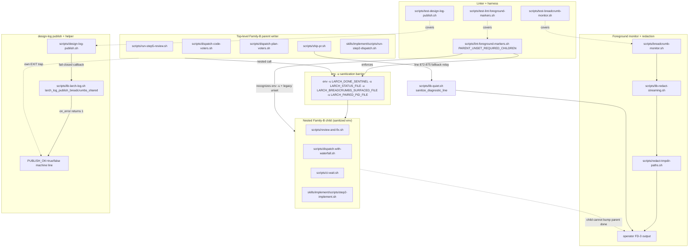

## Architecture Diagram

```mermaid
flowchart TD
    subgraph parent_writer["Top-level Family-B parent writer"]
        runStep5["scripts/run-step5-review.sh"]
        dispatchCode["scripts/dispatch-code-voters.sh"]
        dispatchPlan["scripts/dispatch-plan-voters.sh"]
        shipPR["scripts/ship-pr.sh"]
        runStep2["skills/implement/scripts/run-step2-dispatch.sh"]
    end

    subgraph nested_child["Nested Family-B child (sanitized env)"]
        reviewFix["scripts/review-and-fix.sh"]
        waterfall["scripts/dispatch-with-waterfall.sh"]
        ciWait["scripts/ci-wait.sh"]
        step2Impl["skills/implement/scripts/step2-implement.sh"]
    end

    subgraph env_sanitization["env -u sanitization barrier"]
        envU["env -u LARCH_DONE_SENTINEL -u LARCH_STATUS_FILE -u LARCH_BREADCRUMBS_SURFACED_FILE -u LARCH_PAIRED_PID_FILE"]
    end

    subgraph monitor_pipeline["Foreground monitor + redaction"]
        monitor["scripts/breadcrumb-monitor.sh"]
        redactStream["scripts/lib-redact-streaming.sh"]
        redactTmpdir["scripts/redact-tmpdir-paths.sh"]
        operatorFD3["operator FD-3 output"]
    end

    subgraph publish_pipeline["design-log publish + helper"]
        designPublish["scripts/design-log-publish.sh"]
        libLarchLog["scripts/lib-larch-log.sh larch_log_publish_breadcrumbs_shared"]
        publishOK["PUBLISH_OK=true/false machine line"]
    end

    subgraph lint_layer["Linter + harness"]
        lintFG["scripts/lint-foreground-markers.sh PARENT_UNSET_REQUIRED_CHILDREN"]
        testLint["scripts/test-lint-foreground-markers.sh"]
        testMonitor["scripts/test-breadcrumb-monitor.sh"]
        testPublish["scripts/test-design-log-publish.sh"]
    end

    parent_writer -->|nested call| envU
    envU --> nested_child

    parent_writer -.->|own EXIT trap| publishOK
    nested_child -.->|child cannot bump parent done| operatorFD3

    monitor --> redactStream --> redactTmpdir --> operatorFD3

    designPublish -->|fail-closed callback| libLarchLog
    libLarchLog -->|on_error returns 1| publishOK

    lintFG -->|enforces| envU
    lintFG -->|recognizes env -u + legacy unset| nested_child
    testLint -.->|covers| lintFG
    testMonitor -.->|covers| monitor
    testPublish -.->|covers| designPublish

    sanitizeDiag["scripts/lib-quiet.sh sanitize_diagnostic_line"]
    shipPR -->|line 872-875 fallback relay| sanitizeDiag
    sanitizeDiag --> operatorFD3
```
