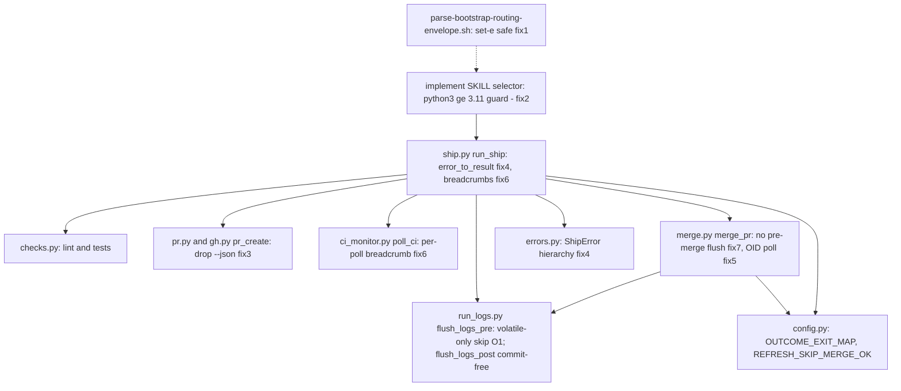

## Architecture Diagram

```mermaid
graph TD
    SELECTOR["implement SKILL selector: python3 ge 3.11 guard - fix2"]
    SHIP["ship.py run_ship: error_to_result fix4, breadcrumbs fix6"]
    CHECKS["checks.py: lint and tests"]
    PRGH["pr.py and gh.py pr_create: drop --json fix3"]
    CIMON["ci_monitor.py poll_ci: per-poll breadcrumb fix6"]
    MERGE["merge.py merge_pr: no pre-merge flush fix7, OID poll fix5"]
    RUNLOGS["run_logs.py flush_logs_pre: volatile-only skip O1; flush_logs_post commit-free"]
    CONFIG["config.py: OUTCOME_EXIT_MAP, REFRESH_SKIP_MERGE_OK"]
    ERRORS["errors.py: ShipError hierarchy fix4"]
    BOOTSTRAP["parse-bootstrap-routing-envelope.sh: set-e safe fix1"]

    SELECTOR --> SHIP
    SHIP --> CHECKS
    SHIP --> PRGH
    SHIP --> CIMON
    SHIP --> MERGE
    SHIP --> RUNLOGS
    MERGE --> RUNLOGS
    MERGE --> CONFIG
    SHIP --> ERRORS
    SHIP --> CONFIG
    BOOTSTRAP -.-> SELECTOR
```
