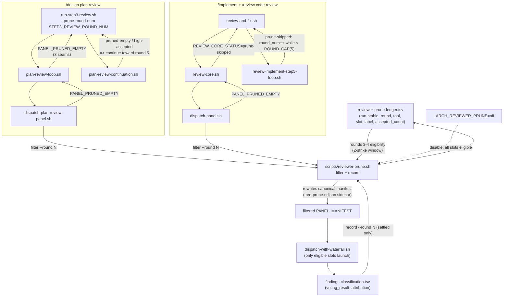

## Architecture Diagram

```mermaid
graph TD
    LEDGER["reviewer-prune-ledger.tsv<br/>(run-stable: round, tool, slot, label, accepted_count)"]
    PRUNE["scripts/reviewer-prune.sh<br/>filter + record"]

    subgraph DESIGN["/design plan review"]
        RS3["run-step3-review.sh<br/>--prune-round-num STEP3_REVIEW_ROUND_NUM"]
        PRL["plan-review-loop.sh"]
        DPRP["dispatch-plan-review-panel.sh"]
        PRC["plan-review-continuation.sh"]
    end

    subgraph CODE["/implement + /review code review"]
        RAF["review-and-fix.sh"]
        RC["review-core.sh"]
        DP["dispatch-panel.sh"]
        LOOP5["review-implement-step5-loop.sh"]
    end

    RS3 --> PRL --> DPRP
    DPRP -->|"filter --round N"| PRUNE
    RAF --> RC --> DP
    DP -->|"filter --round N"| PRUNE
    PRUNE -->|"rewrites canonical manifest<br/>(.pre-prune.ndjson sidecar)"| MANIFEST["filtered PANEL_MANIFEST"]
    MANIFEST --> WF["dispatch-with-waterfall.sh<br/>(only eligible slots launch)"]

    WF --> TALLY["findings-classification.tsv<br/>(voting_result, attribution)"]
    TALLY -->|"record --round N (settled only)"| PRUNE
    PRUNE --> LEDGER
    LEDGER -->|"rounds 3-4 eligibility<br/>(2-strike window)"| PRUNE

    DPRP -->|"PANEL_PRUNED_EMPTY"| PRL
    PRL -->|"PANEL_PRUNED_EMPTY<br/>(3 seams)"| RS3
    RS3 --> PRC
    PRC -->|"pruned-empty / high-accepted<br/>=> continue toward round 5"| RS3

    DP -->|"PANEL_PRUNED_EMPTY"| RC
    RC -->|"REVIEW_CORE_STATUS=prune-skipped"| RAF
    RAF --> LOOP5
    LOOP5 -->|"prune-skipped: round_num++ while < ROUND_CAP(5)"| RAF

    KILL["LARCH_REVIEWER_PRUNE=off"] -.->|"disable: all slots eligible"| PRUNE
```
