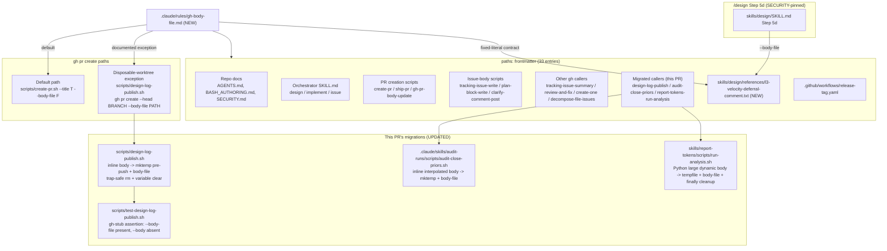

## Architecture Diagram

```mermaid
graph TD
    Rule[".claude/rules/gh-body-file.md (NEW)"]

    subgraph PathTriggers ["paths: frontmatter (33 entries)"]
        Docs["Repo docs<br/>AGENTS.md, BASH_AUTHORING.md, SECURITY.md"]
        Skills["Orchestrator SKILL.md<br/>design / implement / issue"]
        PRScripts["PR creation scripts<br/>create-pr / ship-pr / gh-pr-body-update"]
        IssueScripts["Issue-body scripts<br/>tracking-issue-write / plan-block-write / clarify-comment-post"]
        OtherScripts["Other gh callers<br/>tracking-issue-summary / review-and-fix / create-one / decompose-file-issues"]
        Migrated["Migrated callers (this PR)<br/>design-log-publish / audit-close-priors / report-tokens-run-analysis"]
        Const["skills/design/references/l3-velocity-deferral-comment.txt (NEW)"]
        Workflow[".github/workflows/release-tag.yaml"]
    end

    Rule --> PathTriggers

    subgraph PRPaths ["gh pr create paths"]
        Default["Default path<br/>scripts/create-pr.sh --title T --body-file F"]
        Exception["Disposable-worktree exception<br/>scripts/design-log-publish.sh<br/>gh pr create --head BRANCH --body-file PATH"]
    end

    subgraph Step5d ["/design Step 5d (SECURITY-pinned)"]
        SKILLmd["skills/design/SKILL.md Step 5d"]
        SKILLmd -- "--body-file" --> Const
    end

    Rule -- "default" --> Default
    Rule -- "documented exception" --> Exception
    Rule -- "fixed-literal contract" --> Const

    subgraph Migrations ["This PR's migrations (UPDATED)"]
        DLP["scripts/design-log-publish.sh<br/>inline body -> mktemp pre-push + body-file<br/>trap-safe rm + variable clear"]
        ACP[".claude/skills/audit-runs/scripts/audit-close-priors.sh<br/>inline interpolated body -> mktemp + body-file"]
        RTRA["skills/report-tokens/scripts/run-analysis.sh<br/>Python large dynamic body -> tempfile + body-file + finally cleanup"]
        TDP["scripts/test-design-log-publish.sh<br/>gh-stub assertion: --body-file present, --body absent"]
    end

    Exception --> DLP
    Migrated --> ACP
    Migrated --> RTRA
    DLP --> TDP
```
