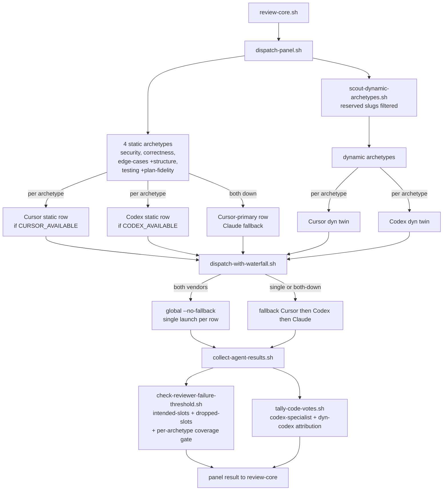

## Architecture Diagram

```mermaid
graph TD
    RC["review-core.sh"] --> DP["dispatch-panel.sh"]
    DP --> STATIC["4 static archetypes<br/>security, correctness,<br/>edge-cases +structure,<br/>testing +plan-fidelity"]
    DP --> SCOUT["scout-dynamic-archetypes.sh<br/>reserved slugs filtered"]
    SCOUT --> DYN["dynamic archetypes"]

    STATIC -->|per archetype| CURS["Cursor static row<br/>if CURSOR_AVAILABLE"]
    STATIC -->|per archetype| CODS["Codex static row<br/>if CODEX_AVAILABLE"]
    STATIC -->|both down| CLA["Cursor-primary row<br/>Claude fallback"]
    DYN -->|per archetype| CURD["Cursor dyn twin"]
    DYN -->|per archetype| CODD["Codex dyn twin"]

    CURS --> WF["dispatch-with-waterfall.sh"]
    CODS --> WF
    CLA --> WF
    CURD --> WF
    CODD --> WF

    WF -->|both vendors| NF["global --no-fallback<br/>single launch per row"]
    WF -->|single or both-down| FB["fallback Cursor then Codex then Claude"]

    NF --> COLLECT["collect-agent-results.sh"]
    FB --> COLLECT

    COLLECT --> THRESH["check-reviewer-failure-threshold.sh<br/>intended-slots + dropped-slots<br/>+ per-archetype coverage gate"]
    COLLECT --> TALLY["tally-code-votes.sh<br/>codex-specialist + dyn-codex attribution"]

    THRESH --> RESULT["panel result to review-core"]
    TALLY --> RESULT
```
