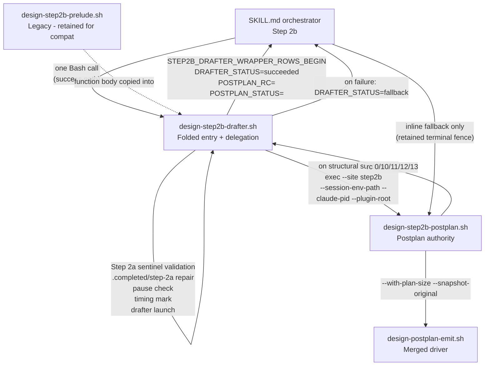

## Architecture Diagram

```mermaid
flowchart TD
    SKILL["SKILL.md orchestrator\nStep 2b"]
    DRAFTER["design-step2b-drafter.sh\nFolded entry + delegation"]
    POSTPLAN["design-step2b-postplan.sh\nPostplan authority"]
    EMIT["design-postplan-emit.sh\nMerged driver"]
    PRELUDE["design-step2b-prelude.sh\nLegacy - retained for compat"]

    SKILL -->|"one Bash call\n(success path)"| DRAFTER
    DRAFTER -->|"Step 2a sentinel validation\n.completed/step-2a repair\npause check\ntiming mark\ndrafter launch"| DRAFTER
    DRAFTER -->|"on structural success:\nexec --site step2b\n--session-env-path --claude-pid --plugin-root"| POSTPLAN
    POSTPLAN -->|"--with-plan-size --snapshot-original"| EMIT
    POSTPLAN -->|"rc 0/10/11/12/13"| DRAFTER
    DRAFTER -->|"STEP2B_DRAFTER_WRAPPER_ROWS_BEGIN\nDRAFTER_STATUS=succeeded\nPOSTPLAN_RC=\nPOSTPLAN_STATUS="| SKILL
    DRAFTER -->|"on failure: DRAFTER_STATUS=fallback"| SKILL
    SKILL -->|"inline fallback only\n(retained terminal fence)"| POSTPLAN
    PRELUDE -.->|"function body copied into"| DRAFTER
```
