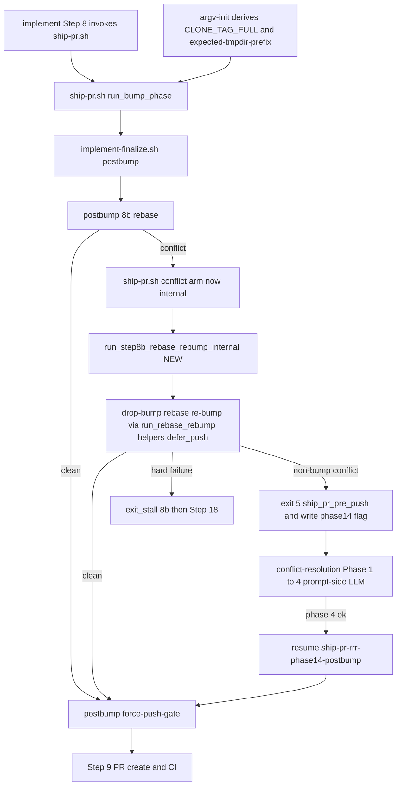

## Architecture Diagram

```mermaid
graph TD
    A[implement Step 8 invokes ship-pr.sh] --> B[ship-pr.sh run_bump_phase]
    L[argv-init derives CLONE_TAG_FULL and expected-tmpdir-prefix] --> B
    B --> C[implement-finalize.sh postbump]
    C --> C2[postbump 8b rebase]
    C2 -->|clean| FPG[postbump force-push-gate]
    C2 -->|conflict| D[ship-pr.sh conflict arm now internal]
    D --> E[run_step8b_rebase_rebump_internal NEW]
    E --> F[drop-bump rebase re-bump via run_rebase_rebump helpers defer_push]
    F -->|clean| FPG
    F -->|hard failure| J[exit_stall 8b then Step 18]
    F -->|non-bump conflict| G[exit 5 ship_pr_pre_push and write phase14 flag]
    G --> H[conflict-resolution Phase 1 to 4 prompt-side LLM]
    H -->|phase 4 ok| I[resume ship-pr-rrr-phase14-postbump]
    I --> FPG
    FPG --> K[Step 9 PR create and CI]
```
