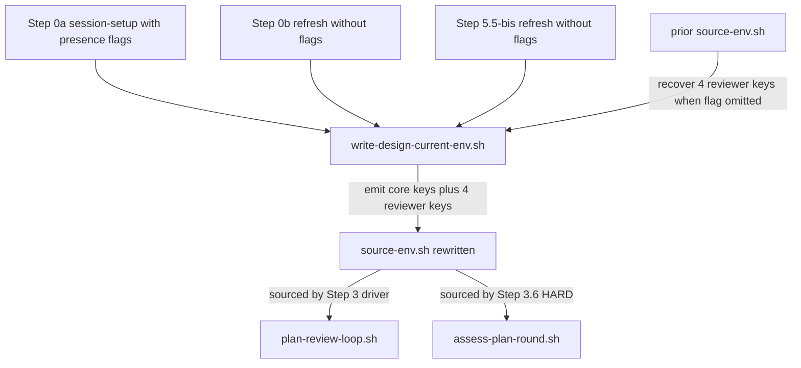

## Architecture Diagram

```mermaid
graph TD
    A[Step 0a session-setup with presence flags] --> W[write-design-current-env.sh]
    B[Step 0b refresh without flags] --> W
    C[Step 5.5-bis refresh without flags] --> W
    P[prior source-env.sh] -->|recover 4 reviewer keys when flag omitted| W
    W -->|emit core keys plus 4 reviewer keys| O[source-env.sh rewritten]
    O -->|sourced by Step 3 driver| R[plan-review-loop.sh]
    O -->|sourced by Step 3.6 HARD| S[assess-plan-round.sh]
```
