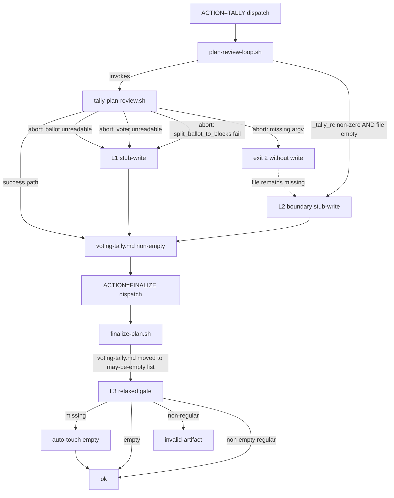

## Architecture Diagram

```mermaid
flowchart TD
    A[ACTION=TALLY dispatch] --> B[plan-review-loop.sh]
    B -->|invokes| C[tally-plan-review.sh]
    C -->|success path| D[voting-tally.md non-empty]
    C -->|abort: ballot unreadable| E1[L1 stub-write]
    C -->|abort: voter unreadable| E1
    C -->|abort: split_ballot_to_blocks fail| E1
    E1 --> D
    C -->|abort: missing argv| F[exit 2 without write]
    B -->|_tally_rc non-zero AND file empty| E2[L2 boundary stub-write]
    F -.->|file remains missing| E2
    E2 --> D
    D --> G[ACTION=FINALIZE dispatch]
    G --> H[finalize-plan.sh]
    H -->|voting-tally.md moved to may-be-empty list| I[L3 relaxed gate]
    I -->|missing| J[auto-touch empty]
    I -->|empty| K[ok]
    I -->|non-regular| L[invalid-artifact]
    I -->|non-empty regular| K
    J --> K
```
