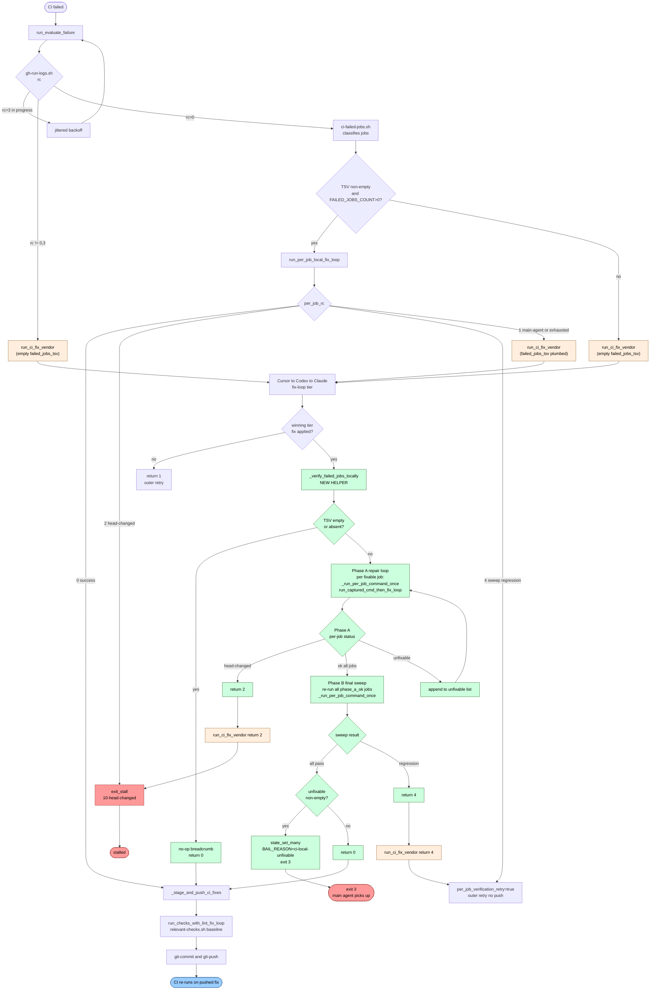

## Architecture Diagram

```mermaid
flowchart TD
    START([CI failed]) --> RUN_EVAL[run_evaluate_failure]
    RUN_EVAL --> GH_LOGS{gh-run-logs.sh<br/>rc}
    GH_LOGS -->|rc=3 in progress| BACKOFF[jittered backoff]
    BACKOFF --> RUN_EVAL
    GH_LOGS -->|rc != 0,3| VENDOR_NOLOGS["run_ci_fix_vendor<br/>(empty failed_jobs_tsv)"]
    GH_LOGS -->|rc=0| CI_FAILED_JOBS[ci-failed-jobs.sh<br/>classifies jobs]

    CI_FAILED_JOBS --> TSV_NONEMPTY{TSV non-empty<br/>and FAILED_JOBS_COUNT>0?}
    TSV_NONEMPTY -->|yes| PER_JOB[run_per_job_local_fix_loop]
    TSV_NONEMPTY -->|no| VENDOR_EMPTY["run_ci_fix_vendor<br/>(empty failed_jobs_tsv)"]

    PER_JOB --> PJ_RC{per_job_rc}
    PJ_RC -->|0 success| STAGE_PUSH[_stage_and_push_ci_fixes]
    PJ_RC -->|2 head-changed| STALL_HC[exit_stall<br/>10-head-changed]
    PJ_RC -->|4 sweep regression| OUTER_RETRY[per_job_verification_retry=true<br/>outer retry no push]
    PJ_RC -->|1 main-agent or exhausted| VENDOR_TSV["run_ci_fix_vendor<br/>(failed_jobs_tsv plumbed)"]

    VENDOR_TSV --> VENDOR_TIER[Cursor to Codex to Claude<br/>fix-loop tier]
    VENDOR_EMPTY --> VENDOR_TIER
    VENDOR_NOLOGS --> VENDOR_TIER
    VENDOR_TIER --> WINNING{winning tier<br/>fix applied?}
    WINNING -->|no| VENDOR_FAIL[return 1<br/>outer retry]
    WINNING -->|yes| VERIFY_HELPER[_verify_failed_jobs_locally<br/>NEW HELPER]

    VERIFY_HELPER --> EMPTY_TSV{TSV empty<br/>or absent?}
    EMPTY_TSV -->|yes| NOOP_WARN[no-op breadcrumb<br/>return 0]
    NOOP_WARN --> STAGE_PUSH
    EMPTY_TSV -->|no| PHASE_A[Phase A repair loop<br/>per fixable job:<br/>_run_per_job_command_once<br/>run_captured_cmd_then_fix_loop]

    PHASE_A --> PA_RESULT{Phase A<br/>per-job status}
    PA_RESULT -->|head-changed| RETURN_2[return 2]
    PA_RESULT -->|ok all jobs| PHASE_B[Phase B final sweep<br/>re-run all phase_a_ok jobs<br/>_run_per_job_command_once]
    PA_RESULT -->|unfixable| UNFIX_COLLECT[append to unfixable list]
    UNFIX_COLLECT --> PHASE_A
    PHASE_B --> PB_RESULT{sweep result}
    PB_RESULT -->|all pass| CHECK_UNFIX{unfixable<br/>non-empty?}
    PB_RESULT -->|regression| RETURN_4[return 4]
    CHECK_UNFIX -->|yes| BAIL_CILU[state_set_many<br/>BAIL_REASON=ci-local-unfixable<br/>exit 3]
    CHECK_UNFIX -->|no| RETURN_0[return 0]

    RETURN_0 --> STAGE_PUSH
    RETURN_2 --> VENDOR_RC2[run_ci_fix_vendor return 2]
    RETURN_4 --> VENDOR_RC4[run_ci_fix_vendor return 4]
    VENDOR_RC2 --> STALL_HC
    VENDOR_RC4 --> OUTER_RETRY

    STAGE_PUSH --> RELEVANT_CHECKS[run_checks_with_lint_fix_loop<br/>relevant-checks.sh baseline]
    RELEVANT_CHECKS --> GIT_COMMIT[git-commit and git-push]
    GIT_COMMIT --> DONE([CI re-runs on pushed fix])

    BAIL_CILU --> EXIT3([exit 3<br/>main agent picks up])
    STALL_HC --> STALL_END([stalled])

    classDef new fill:#cfd,stroke:#363,color:#000
    classDef changed fill:#fed,stroke:#963,color:#000
    classDef stall fill:#f99,stroke:#933,color:#000
    classDef done fill:#9cf,stroke:#369,color:#000
    class VERIFY_HELPER,PHASE_A,PHASE_B,NOOP_WARN,EMPTY_TSV,PA_RESULT,PB_RESULT,CHECK_UNFIX,UNFIX_COLLECT,BAIL_CILU,RETURN_0,RETURN_2,RETURN_4 new
    class VENDOR_TSV,VENDOR_EMPTY,VENDOR_NOLOGS,VENDOR_RC2,VENDOR_RC4 changed
    class STALL_HC,STALL_END,EXIT3 stall
    class DONE done
```
