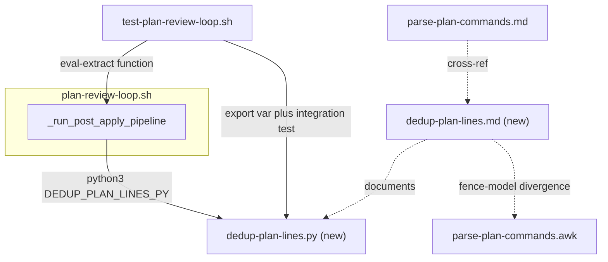

## Architecture Diagram

```mermaid
graph TD
    subgraph PRL["plan-review-loop.sh"]
        PA["_run_post_apply_pipeline"]
    end
    DEDUP["dedup-plan-lines.py (new)"]
    DEDUPMD["dedup-plan-lines.md (new)"]
    AWK["parse-plan-commands.awk"]
    AWKMD["parse-plan-commands.md"]
    TEST["test-plan-review-loop.sh"]

    PA -->|"python3 DEDUP_PLAN_LINES_PY"| DEDUP
    TEST -->|"eval-extract function"| PA
    TEST -->|"export var plus integration test"| DEDUP
    DEDUPMD -.->|documents| DEDUP
    DEDUPMD -.->|fence-model divergence| AWK
    AWKMD -.->|cross-ref| DEDUPMD
```
