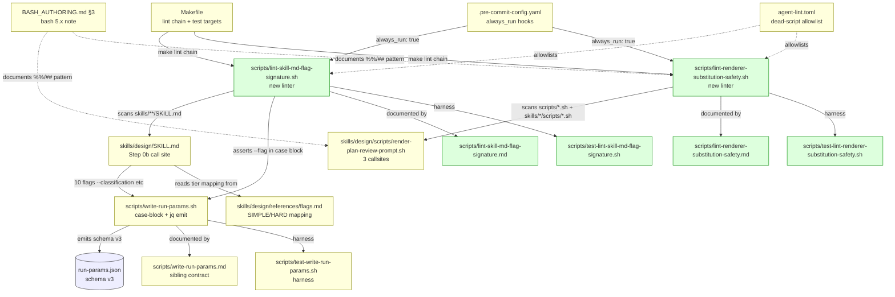

## Architecture Diagram

```mermaid
graph TD
    SKILL["skills/design/SKILL.md<br/>Step 0b call site"]
    WRP["scripts/write-run-params.sh<br/>case-block + jq emit"]
    WRPMD["scripts/write-run-params.md<br/>sibling contract"]
    WRPTEST["scripts/test-write-run-params.sh<br/>harness"]
    FLAGS["skills/design/references/flags.md<br/>SIMPLE/HARD mapping"]
    RPRP["skills/design/scripts/render-plan-review-prompt.sh<br/>3 callsites"]
    BASHAUTH["BASH_AUTHORING.md §3<br/>bash 5.x note"]

    LFS["scripts/lint-skill-md-flag-signature.sh<br/>new linter"]
    LFSMD["scripts/lint-skill-md-flag-signature.md"]
    LFSTEST["scripts/test-lint-skill-md-flag-signature.sh"]

    LRS["scripts/lint-renderer-substitution-safety.sh<br/>new linter"]
    LRSMD["scripts/lint-renderer-substitution-safety.md"]
    LRSTEST["scripts/test-lint-renderer-substitution-safety.sh"]

    MAKEFILE["Makefile<br/>lint chain + test targets"]
    PRECOMMIT[".pre-commit-config.yaml<br/>always_run hooks"]
    AGENTLINT["agent-lint.toml<br/>dead-script allowlist"]

    RUNPARAMS[(run-params.json<br/>schema v3)]

    SKILL -- "10 flags --classification etc" --> WRP
    WRP -- "emits schema v3" --> RUNPARAMS
    WRP -- documented by --> WRPMD
    WRP -- harness --> WRPTEST
    SKILL -- reads tier mapping from --> FLAGS

    LFS -- "scans skills/**/SKILL.md" --> SKILL
    LFS -- "asserts --flag in case block" --> WRP
    LFS -- documented by --> LFSMD
    LFS -- harness --> LFSTEST

    LRS -- "scans scripts/*.sh + skills/*/scripts/*.sh" --> RPRP
    LRS -- documented by --> LRSMD
    LRS -- harness --> LRSTEST

    BASHAUTH -. "documents %%/## pattern" .-> RPRP
    BASHAUTH -. "documents %%/## pattern" .-> LRS

    MAKEFILE -- "make lint chain" --> LFS
    MAKEFILE -- "make lint chain" --> LRS
    PRECOMMIT -- "always_run: true" --> LFS
    PRECOMMIT -- "always_run: true" --> LRS
    AGENTLINT -. "allowlists" .-> LFS
    AGENTLINT -. "allowlists" .-> LRS

    classDef new fill:#dfd,stroke:#080
    classDef updated fill:#ffd,stroke:#880
    classDef sink fill:#eef,stroke:#333

    class LFS,LFSMD,LFSTEST,LRS,LRSMD,LRSTEST new
    class SKILL,WRP,WRPMD,WRPTEST,FLAGS,RPRP,BASHAUTH,MAKEFILE,PRECOMMIT,AGENTLINT updated
    class RUNPARAMS sink
```
