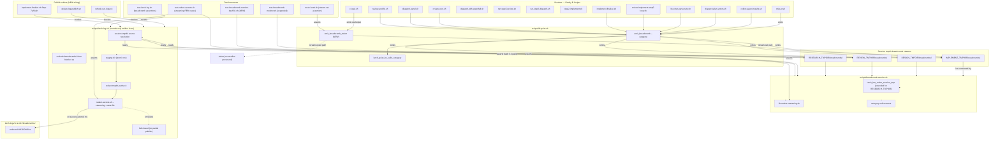

## Architecture Diagram

```mermaid
graph TD
    subgraph Runtime["Runtime — Family B Scripts"]
        ShipPR["ship-pr.sh"]
        CIWait["ci-wait.sh"]
        Collect["collect-agent-results.sh"]
        DispatchVoters["dispatch-plan-voters.sh"]
        DispatchWaterfall["dispatch-with-waterfall.sh"]
        Run5["run-step5-review.sh"]
        Run2["run-step2-dispatch.sh"]
        Step2["step2-implement.sh"]
        RAF["review-and-fix.sh"]
        Step5Loop["review-implement-step5-loop.sh"]
        VoterParse["lib-voter-parse-rate.sh"]
        ImplFinalize["implement-finalize.sh"]
        ReviewCore["review-core.sh"]
        DispatchPanel["dispatch-panel.sh"]
    end

    subgraph LibQuiet["scripts/lib-quiet.sh"]
        EmitBC["emit_breadcrumb --category"]
        EmitBCStderr["emit_breadcrumb_stderr (NEW)"]
        ValidCat["larch_quiet_bc_valid_category"]
    end

    subgraph Streams["Session tmpdir breadcrumb streams"]
        ImplStream["IMPLEMENT_TMPDIR/breadcrumbs/"]
        DesignStream["DESIGN_TMPDIR/breadcrumbs/"]
        ReviewStream["REVIEW_TMPDIR/breadcrumbs/"]
        ResearchStream["RESEARCH_TMPDIR/breadcrumbs/"]
    end

    subgraph Monitor["scripts/breadcrumb-monitor.sh"]
        PathScope["larch_bm_under_session_tmp (extended for RESEARCH_TMPDIR)"]
        LiveRedact["lib-redact-streaming.sh"]
        CategoryFilter["category enforcement"]
    end

    subgraph CommitPipeline["scripts/larch-log.sh (commit-only artifact class)"]
        SrcResolve["session-tmpdir source resolution"]
        ExcludeRaw["exclude breadcrumbs/ from blanket cp"]
        Staging["staging dir (atomic mv)"]
        TmpdirRedact["redact-tmpdir-paths.sh"]
        SecretRedact["redact-secrets.sh --streaming --state-file"]
        FailClosed["fail-closed (no partial publish)"]
    end

    subgraph PublishCallers["Publish callers (NEW wiring)"]
        RefreshLogs["refresh-run-logs.sh"]
        DesignPublish["design-log-publish.sh"]
        ImplFlush["implement-finalize.sh Step 7a/flush"]
    end

    subgraph CommittedLogs["larch-logs/&lt;run-id&gt;/breadcrumbs/"]
        RedactedBreadcrumbs["redacted NDJSON files"]
    end

    subgraph Tests["Test harnesses"]
        TestMonitor["test-breadcrumb-monitor.sh (expanded)"]
        TestMonitorBash32["test-breadcrumb-monitor-bash32.sh (NEW)"]
        TestRedact["test-redact-secrets.sh (streaming PEM cases)"]
        TestLarchLog["test-larch-log.sh (breadcrumb assertions)"]
        TestCIWait["test-ci-wait.sh (stream-set assertion)"]
    end

    ShipPR -->|emits| EmitBC
    CIWait -->|emits via helper| EmitBCStderr
    Collect --> EmitBC
    DispatchVoters --> EmitBC
    VoterParse --> EmitBC
    Step5Loop --> EmitBC
    ImplFinalize --> EmitBC
    ReviewCore --> EmitBC
    DispatchPanel --> EmitBC
    RAF --> EmitBC

    EmitBC -->|writes| ImplStream
    EmitBC -->|writes| DesignStream
    EmitBC -->|writes| ReviewStream
    EmitBC -->|writes| ResearchStream
    EmitBCStderr -->|stream-set path| ImplStream
    EmitBCStderr -.->|stream-unset path| larch_errf_stderr["stderr (no-newline preserved)"]
    EmitBC --> ValidCat

    ImplStream -->|live consumed by| Monitor
    DesignStream --> Monitor
    ReviewStream --> Monitor
    ResearchStream --> Monitor

    Monitor --> PathScope
    Monitor --> LiveRedact
    Monitor --> CategoryFilter

    RefreshLogs -->|invokes| CommitPipeline
    DesignPublish -->|invokes| CommitPipeline
    ImplFlush -->|invokes| CommitPipeline

    CommitPipeline --> SrcResolve
    SrcResolve -->|reads| ImplStream
    SrcResolve -->|reads| DesignStream
    SrcResolve -->|reads| ReviewStream
    CommitPipeline --> ExcludeRaw
    CommitPipeline --> Staging
    Staging --> TmpdirRedact
    TmpdirRedact --> SecretRedact
    SecretRedact -->|on success atomic mv| RedactedBreadcrumbs
    SecretRedact -.->|on failure| FailClosed

    TestMonitor -->|asserts| Monitor
    TestMonitorBash32 -->|asserts bash 3.2 parity| Monitor
    TestRedact -->|asserts| LiveRedact
    TestRedact -->|asserts| SecretRedact
    TestLarchLog -->|asserts| CommitPipeline
    TestCIWait -->|asserts| EmitBCStderr
```
