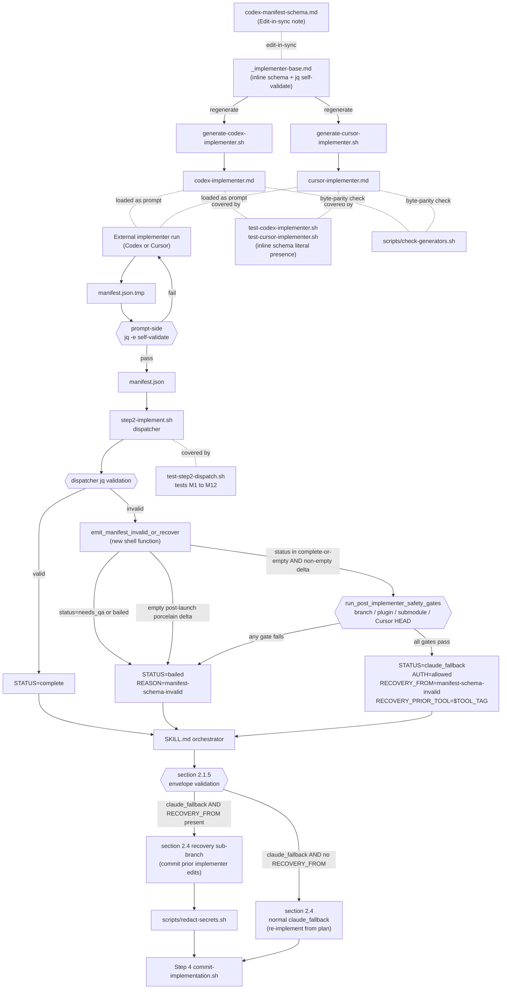

## Architecture Diagram

```mermaid
graph TD
    BASE["_implementer-base.md<br/>(inline schema + jq self-validate)"]
    GEN1[generate-codex-implementer.sh]
    GEN2[generate-cursor-implementer.sh]
    CODEX_AGENT[codex-implementer.md]
    CURSOR_AGENT[cursor-implementer.md]
    SCHEMA_REF["codex-manifest-schema.md<br/>(Edit-in-sync note)"]

    BASE -->|regenerate| GEN1
    BASE -->|regenerate| GEN2
    GEN1 --> CODEX_AGENT
    GEN2 --> CURSOR_AGENT
    SCHEMA_REF -.-|edit-in-sync| BASE

    IMPL_RUN["External implementer run<br/>(Codex or Cursor)"]
    MANIFEST["manifest.json.tmp"]
    SELF_VALIDATE{{"prompt-side<br/>jq -e self-validate"}}
    MANIFEST_FINAL[manifest.json]

    CODEX_AGENT -.-|loaded as prompt| IMPL_RUN
    CURSOR_AGENT -.-|loaded as prompt| IMPL_RUN
    IMPL_RUN --> MANIFEST
    MANIFEST --> SELF_VALIDATE
    SELF_VALIDATE -->|pass| MANIFEST_FINAL
    SELF_VALIDATE -->|fail| IMPL_RUN

    DISPATCHER["step2-implement.sh<br/>dispatcher"]
    DSP_VALIDATE{{"dispatcher jq validation"}}
    RECOVER_FN["emit_manifest_invalid_or_recover<br/>(new shell function)"]
    SAFETY_GATES{{"run_post_implementer_safety_gates<br/>branch / plugin / submodule / Cursor HEAD"}}
    EMIT_BAILED[STATUS=bailed<br/>REASON=manifest-schema-invalid]
    EMIT_RECOVERY["STATUS=claude_fallback<br/>AUTH=allowed<br/>RECOVERY_FROM=manifest-schema-invalid<br/>RECOVERY_PRIOR_TOOL=$TOOL_TAG"]

    MANIFEST_FINAL --> DISPATCHER
    DISPATCHER --> DSP_VALIDATE
    DSP_VALIDATE -->|valid| EMIT_COMPLETE[STATUS=complete]
    DSP_VALIDATE -->|invalid| RECOVER_FN
    RECOVER_FN -->|status=needs_qa or bailed| EMIT_BAILED
    RECOVER_FN -->|empty post-launch porcelain delta| EMIT_BAILED
    RECOVER_FN -->|status in complete-or-empty AND non-empty delta| SAFETY_GATES
    SAFETY_GATES -->|any gate fails| EMIT_BAILED
    SAFETY_GATES -->|all gates pass| EMIT_RECOVERY

    ORCHESTRATOR["SKILL.md orchestrator"]
    SEC2_1_5{{"section 2.1.5<br/>envelope validation"}}
    SEC2_4_NORMAL["section 2.4<br/>normal claude_fallback<br/>(re-implement from plan)"]
    SEC2_4_RECOVERY["section 2.4 recovery sub-branch<br/>(commit prior implementer edits)"]
    REDACT["scripts/redact-secrets.sh"]
    STEP4_COMMIT[Step 4 commit-implementation.sh]

    EMIT_COMPLETE --> ORCHESTRATOR
    EMIT_BAILED --> ORCHESTRATOR
    EMIT_RECOVERY --> ORCHESTRATOR
    ORCHESTRATOR --> SEC2_1_5
    SEC2_1_5 -->|claude_fallback AND no RECOVERY_FROM| SEC2_4_NORMAL
    SEC2_1_5 -->|claude_fallback AND RECOVERY_FROM present| SEC2_4_RECOVERY
    SEC2_4_RECOVERY --> REDACT
    REDACT --> STEP4_COMMIT
    SEC2_4_NORMAL --> STEP4_COMMIT

    TEST_DISP["test-step2-dispatch.sh<br/>tests M1 to M12"]
    TEST_AGENTS["test-codex-implementer.sh<br/>test-cursor-implementer.sh<br/>(inline schema literal presence)"]
    CHECK_GEN["scripts/check-generators.sh"]

    DISPATCHER -.-|covered by| TEST_DISP
    CODEX_AGENT -.-|covered by| TEST_AGENTS
    CURSOR_AGENT -.-|covered by| TEST_AGENTS
    CODEX_AGENT -.-|byte-parity check| CHECK_GEN
    CURSOR_AGENT -.-|byte-parity check| CHECK_GEN
```
