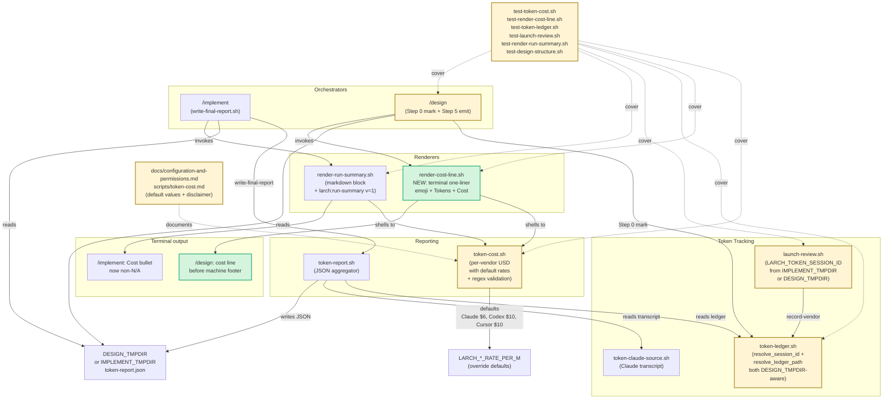

## Architecture Diagram

```mermaid
graph TD
  subgraph orchestrators[Orchestrators]
    Impl["/implement<br/>(write-final-report.sh)"]
    Des["/design<br/>(Step 0 mark + Step 5 emit)"]
  end

  subgraph ledger_layer[Token Tracking]
    Launch["launch-review.sh<br/>(LARCH_TOKEN_SESSION_ID<br/>from IMPLEMENT_TMPDIR<br/>or DESIGN_TMPDIR)"]
    Tlg["token-ledger.sh<br/>(resolve_session_id +<br/>resolve_ledger_path<br/>both DESIGN_TMPDIR-aware)"]
    Tcs["token-claude-source.sh<br/>(Claude transcript)"]
  end

  subgraph reporting[Reporting]
    Trep["token-report.sh<br/>(JSON aggregator)"]
    Tcost["token-cost.sh<br/>(per-vendor USD<br/>with default rates<br/>+ regex validation)"]
  end

  subgraph renderers[Renderers]
    RRS["render-run-summary.sh<br/>(markdown block<br/>+ larch:run-summary v=1)"]
    RCL["render-cost-line.sh<br/>NEW: terminal one-liner<br/>emoji + Tokens + Cost"]
  end

  subgraph output[Terminal output]
    SumBlk["/implement: Cost bullet<br/>now non-N/A"]
    CostLn["/design: cost line<br/>before machine footer"]
  end

  Des -->|Step 0 mark| Tlg
  Impl -->|write-final-report| Trep
  Launch -->|record-vendor| Tlg
  Trep -->|reads ledger| Tlg
  Trep -->|reads transcript| Tcs
  Trep -->|writes JSON| TokenJson["DESIGN_TMPDIR<br/>or IMPLEMENT_TMPDIR<br/>token-report.json"]
  Impl -->|reads| TokenJson
  Des -->|reads| TokenJson
  Impl -->|invokes| RRS
  Des -->|invokes| RCL
  RRS -->|shells to| Tcost
  RCL -->|shells to| Tcost
  Tcost -->|defaults<br/>Claude $6, Codex $10, Cursor $10| RatesEnv["LARCH_*_RATE_PER_M<br/>(override defaults)"]
  RRS --> SumBlk
  RCL --> CostLn

  Docs["docs/configuration-and-permissions.md<br/>scripts/token-cost.md<br/>(default values + disclaimer)"] -.->|documents| Tcost
  Tests["test-token-cost.sh<br/>test-render-cost-line.sh<br/>test-token-ledger.sh<br/>test-launch-review.sh<br/>test-render-run-summary.sh<br/>test-design-structure.sh"] -.->|cover| Tcost
  Tests -.->|cover| RCL
  Tests -.->|cover| Tlg
  Tests -.->|cover| Launch
  Tests -.->|cover| RRS
  Tests -.->|cover| Des

  classDef new fill:#d4f4dd,stroke:#2a7,stroke-width:2px
  classDef changed fill:#fff4d4,stroke:#a82,stroke-width:2px
  class RCL,CostLn new
  class Des,Tcost,Tlg,Launch,Docs,Tests changed
```
