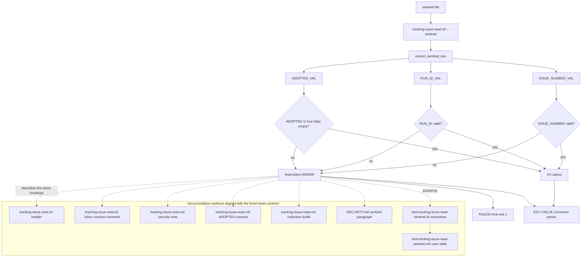

## Architecture Diagram

```mermaid
flowchart TD
    A[sentinel file] --> B[tracking-issue-read.sh --sentinel]
    B --> C[extract_sentinel_key]
    C --> D[ISSUE_NUMBER_VAL]
    C --> E[RUN_ID_VAL]
    C --> F[ADOPTED_VAL]
    D --> G{ISSUE_NUMBER valid?}
    E --> H{RUN_ID valid?}
    F --> I{ADOPTED in true false empty?}
    G -- yes --> J[KV stdout]
    H -- yes --> J
    I -- yes --> J
    G -- no --> K[fixed-token ERROR]
    H -- no --> K
    I -- no --> K
    K --> L[FAILED=true exit 1]
    J --> M[KEY=VALUE consumer parser]
    K --> M

    subgraph DocSurfaces[Documentation surfaces aligned with the fixed-token contract]
        N[tracking-issue-read.sh header]
        O[tracking-issue-read.sh inline contract comment]
        P[tracking-issue-read.md security note]
        Q[tracking-issue-read.md ADOPTED contract]
        R[tracking-issue-read.md redaction bullet]
        S[SECURITY.md sentinel paragraph]
        T[test-tracking-issue-read-sentinel.sh assertions]
        U[test-tracking-issue-read-sentinel.md case table]
    end

    K -.->|describes the same envelope| N
    K -.-> O
    K -.-> P
    K -.-> Q
    K -.-> R
    K -.-> S
    K -.->|pinned by| T
    T -.-> U
```
