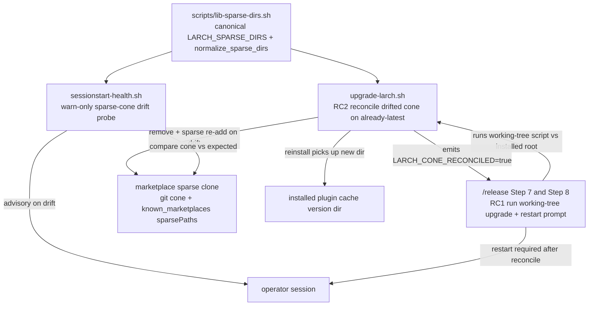

## Architecture Diagram

```mermaid
graph TD
    LIB["scripts/lib-sparse-dirs.sh<br/>canonical LARCH_SPARSE_DIRS + normalize_sparse_dirs"]
    UPG["upgrade-larch.sh<br/>RC2 reconcile drifted cone on already-latest"]
    HOOK["sessionstart-health.sh<br/>warn-only sparse-cone drift probe"]
    REL["/release Step 7 and Step 8<br/>RC1 run working-tree upgrade + restart prompt"]
    MKT["marketplace sparse clone<br/>git cone + known_marketplaces sparsePaths"]
    CACHE["installed plugin cache version dir"]
    OP["operator session"]

    LIB --> UPG
    LIB --> HOOK
    REL -->|"runs working-tree script vs installed root"| UPG
    UPG -->|"emits LARCH_CONE_RECONCILED=true"| REL
    UPG -->|"remove + sparse re-add on drift"| MKT
    UPG -->|"reinstall picks up new dir"| CACHE
    HOOK -->|"compare cone vs expected"| MKT
    HOOK -->|"advisory on drift"| OP
    REL -->|"restart required after reconcile"| OP
```
