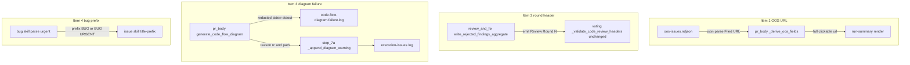

## Architecture Diagram

```mermaid
graph TD
    subgraph i1["Item 1 OOS URL"]
        NDJSON["oos-issues.ndjson"]
        DOF["pr_body _derive_oos_fields"]
        SUMMARY["run-summary render"]
    end
    subgraph i2["Item 2 round header"]
        WRFA["review_and_fix write_rejected_findings_aggregate"]
        VAL["voting _validate_code_review_headers unchanged"]
    end
    subgraph i3["Item 3 diagram failure"]
        GCFD["pr_body generate_code_flow_diagram"]
        FLOG["code-flow-diagram.failure.log"]
        WARN["step_7a _append_diagram_warning"]
        EXEC["execution-issues log"]
    end
    subgraph i4["Item 4 bug prefix"]
        BUG["bug skill parse urgent"]
        ISSUE["issue skill title-prefix"]
    end

    NDJSON -->|"json parse Filed URL"| DOF
    DOF -->|"full clickable url"| SUMMARY
    WRFA -->|"emit Review Round N"| VAL
    GCFD -->|"redacted stderr stdout"| FLOG
    GCFD -->|"reason rc and path"| WARN
    WARN --> EXEC
    BUG -->|"prefix BUG or BUG URGENT"| ISSUE
```
