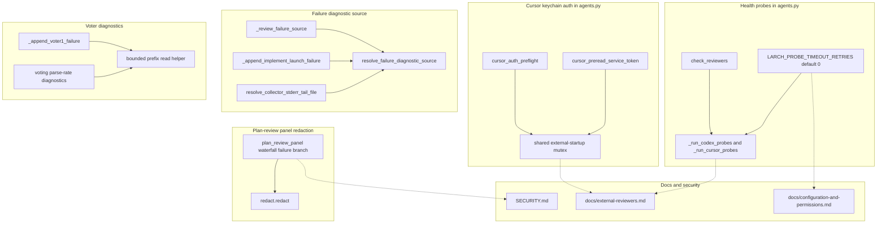

## Architecture Diagram

```mermaid
graph TD
    subgraph probes["Health probes in agents.py"]
        CR["check_reviewers"]
        CP["_run_codex_probes and _run_cursor_probes"]
        ENV["LARCH_PROBE_TIMEOUT_RETRIES default 0"]
        CR --> CP
        ENV --> CP
    end

    subgraph cursor["Cursor keychain auth in agents.py"]
        PF["cursor_auth_preflight"]
        PR["cursor_preread_service_token"]
        MX["shared external-startup mutex"]
        PF --> MX
        PR --> MX
    end

    subgraph diag["Failure diagnostic source"]
        RV["_review_failure_source"]
        IM["_append_implement_launch_failure"]
        ST["resolve_collector_stderr_tail_file"]
        RS["resolve_failure_diagnostic_source"]
        RV --> RS
        IM --> RS
        ST --> RS
    end

    subgraph voters["Voter diagnostics"]
        V1["_append_voter1_failure"]
        VP["voting parse-rate diagnostics"]
        BR["bounded prefix read helper"]
        V1 --> BR
        VP --> BR
    end

    subgraph panel["Plan-review panel redaction"]
        PWF["plan_review_panel waterfall failure branch"]
        RED["redact.redact"]
        PWF --> RED
    end

    subgraph docs["Docs and security"]
        D1["docs/external-reviewers.md"]
        D2["docs/configuration-and-permissions.md"]
        SEC["SECURITY.md"]
    end

    ENV -.-> D2
    CP -.-> D1
    MX -.-> D1
    PWF -.-> SEC
```
