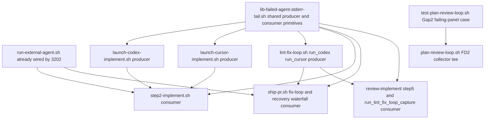

## Architecture Diagram

```mermaid
graph TD
  LIB[lib-failed-agent-stderr-tail.sh shared producer and consumer primitives]
  REA[run-external-agent.sh already wired by 3202]

  LCI[launch-codex-implement.sh producer]
  LCU[launch-cursor-implement.sh producer]
  LFL[lint-fix-loop.sh run_codex run_cursor producer]

  S2[step2-implement.sh consumer]
  SHIP[ship-pr.sh fix-loop and recovery waterfall consumer]
  S5[review-implement step5 and run_lint_fix_loop_capture consumer]

  PRL[plan-review-loop.sh FD2 collector tee]
  GAP2[test-plan-review-loop.sh Gap2 failing-panel case]

  LIB --> LCI
  LIB --> LCU
  LIB --> LFL
  LIB --> S2
  LIB --> SHIP
  LIB --> S5
  REA --> S2
  REA --> SHIP

  LCI --> S2
  LCU --> S2
  LFL --> SHIP
  LFL --> S5

  GAP2 --> PRL
```
