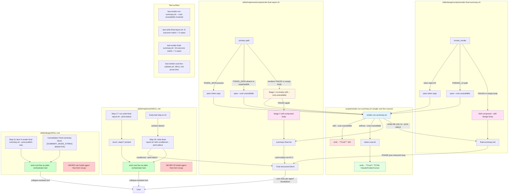

## Architecture Diagram

```mermaid
flowchart TB
    subgraph Renderer["scripts/render-run-summary.sh (single cost line source)"]
        RR[render-run-summary.sh]
        RR -->|with --cost-unavailable| RR_NA["emit: - **Cost**: N/A"]
        RR -->|without --cost-unavailable| TC[token-cost.sh]
        TC --> RR_Cost["emit: - **Cost**: TOTAL Claude/Codex/Cursor"]
    end

    subgraph WriteFinalReport["skills/implement/scripts/write-final-report.sh"]
        WFR_Main[primary path]
        WFR_Main -->|TOKEN_JSON present| WFR_PassTokens[pass token args]
        WFR_Main -->|TOKEN_JSON absent or unparseable| WFR_Unavail[pass --cost-unavailable]
        WFR_PassTokens --> RR
        WFR_Unavail --> RR
        WFR_Main -->|renderer FAILED or empty body| WFR_S1[Stage 1 re-invoke with --cost-unavailable]
        WFR_S1 --> RR
        WFR_S1 -->|FAILED again| WFR_S2[Stage 2 self-composed body]
        WFR_S2 --> Body[summary-final.md]
        RR --> Body
        Body -->|--print-stdout via FD 3| Chat[Chat structured block]
    end

    subgraph RenderFinalSummary["skills/design/scripts/render-final-summary.sh"]
        RFS_Main[invoke_render]
        RFS_Main -->|token data OK| RFS_Args[pass token args]
        RFS_Main -->|FINDING_12 path| RFS_Unavail[pass --cost-unavailable]
        RFS_Args --> RR
        RFS_Unavail --> RR
        RR -->|writes file only no --print-stdout| FinalSummary[final-summary.md]
        RFS_Main -->|FAILED or empty body| RFS_Fallback[Self-composed --skill design body]
        RFS_Fallback --> FinalSummary
        FinalSummary -->|PHASE post chat-print loop| Chat
    end

    subgraph SkillMDImplement["skills/implement/SKILL.md"]
        Step17[Step 17: run write-final-report.sh --print-stdout]
        Step17_Sentinel[touch .step17-printed]
        Step17_CostLine[emit cost line as plain orchestrator text]
        Step18[Step 18: write-final-report.sh with conditional --print-stdout]
        SkipBail[Early-bail skip-to-18]
        NEVER20[NEVER 20 forbid agent free-form recap]

        Step17 --> Step17_Sentinel
        Step17_Sentinel --> Step17_CostLine
        SkipBail -->|sentinel absent| Step18
        Step18 -->|conditional --print-stdout| Chat
        Step18 --> Step17_CostLine
    end

    subgraph SkillMDDesign["skills/design/SKILL.md"]
        Step5c[Step 5c item 9 render-final-summary.sh --post-publish-only]
        FinalSummaryBlock["Cancellation Final summary block (SUMMARY_MODE_STRING default N/A)"]
        Design_CostLine[emit cost line as plain orchestrator text]
        NEVERDesign[NEVER rule forbid agent free-form recap]

        Step5c --> Design_CostLine
        FinalSummaryBlock --> Design_CostLine
    end

    Chat -->|user sees per-agent breakdown| User
    Step17_CostLine -->|collapse-resistant text| User
    Design_CostLine -->|collapse-resistant text| User

    subgraph Tests["Test surface"]
        T1[test-render-run-summary.sh: --cost-unavailable invariant]
        T2[test-write-final-report.sh: 9-outcome matrix + 5 cases]
        T3[test-render-final-summary.sh: 10-outcome matrix + 4 cases]
        T4[test-render-cost-line-callsites.sh: SKILL.md prose lints]
    end

    style RR fill:#e1f5ff
    style RR_NA fill:#ffe1e1
    style RR_Cost fill:#e1ffe1
    style WFR_S1 fill:#fff4e1
    style WFR_S2 fill:#ffe1f4
    style RFS_Fallback fill:#ffe1f4
    style NEVER20 fill:#ffcccc
    style NEVERDesign fill:#ffcccc
    style Step17_CostLine fill:#ccffcc
    style Design_CostLine fill:#ccffcc
```
