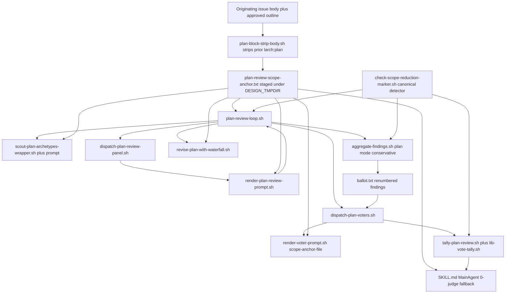

## Architecture Diagram

```mermaid
graph TD
    Issue[Originating issue body plus approved outline]
    Strip[plan-block-strip-body.sh strips prior larch:plan]
    Anchor[plan-review-scope-anchor.txt staged under DESIGN_TMPDIR]
    Loop[plan-review-loop.sh]
    Scout[scout-plan-archetypes-wrapper.sh plus prompt]
    Panel[dispatch-plan-review-panel.sh]
    Reviewer[render-plan-review-prompt.sh]
    Voters[dispatch-plan-voters.sh]
    VoterPrompt[render-voter-prompt.sh scope-anchor-file]
    Revise[revise-plan-with-waterfall.sh]
    Detector[check-scope-reduction-marker.sh canonical detector]
    Aggregate[aggregate-findings.sh plan mode conservative]
    Tally[tally-plan-review.sh plus lib-vote-tally.sh]
    MainAgent[SKILL.md MainAgent 0-judge fallback]
    Ballot[ballot.txt renumbered findings]

    Issue --> Strip
    Strip --> Anchor
    Anchor --> Loop
    Loop --> Scout
    Loop --> Panel
    Panel --> Reviewer
    Loop --> Voters
    Voters --> VoterPrompt
    Loop --> Revise
    Anchor --> Scout
    Anchor --> Reviewer
    Anchor --> VoterPrompt
    Anchor --> Revise
    Anchor --> MainAgent
    Reviewer --> Loop
    Loop --> Aggregate
    Aggregate --> Ballot
    Ballot --> Voters
    Voters --> Tally
    Detector --> Loop
    Detector --> Aggregate
    Detector --> Tally
    Tally --> MainAgent
```
