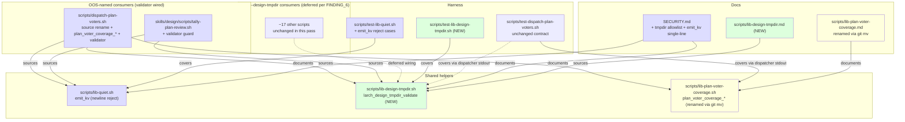

## Architecture Diagram

```mermaid
graph TD
    subgraph "Shared helpers"
        LQ["scripts/lib-quiet.sh<br/>emit_kv (newline reject)"]
        LDT["scripts/lib-design-tmpdir.sh<br/>larch_design_tmpdir_validate (NEW)"]
        LPVC["scripts/lib-plan-voter-coverage.sh<br/>plan_voter_coverage_* (renamed via git mv)"]
    end

    subgraph "OOS-named consumers (validator wired)"
        DPV["scripts/dispatch-plan-voters.sh<br/>source rename + plan_voter_coverage_* + validator"]
        TPR["skills/design/scripts/tally-plan-review.sh<br/>+ validator guard"]
    end

    subgraph "Other --design-tmpdir consumers (deferred per FINDING_6)"
        OTH["~17 other scripts<br/>unchanged in this pass"]
    end

    subgraph "Harness"
        TLDT["scripts/test-lib-design-tmpdir.sh (NEW)"]
        TLQ["scripts/test-lib-quiet.sh<br/>+ emit_kv reject cases"]
        TDPV["scripts/test-dispatch-plan-voters.sh<br/>unchanged contract"]
    end

    subgraph "Docs"
        SEC["SECURITY.md<br/>+ tmpdir allowlist + emit_kv single-line"]
        LDTMD["scripts/lib-design-tmpdir.md (NEW)"]
        LPVCMD["scripts/lib-plan-voter-coverage.md<br/>renamed via git mv"]
    end

    DPV -->|sources| LQ
    DPV -->|sources| LPVC
    DPV -->|sources| LDT
    TPR -->|sources| LDT
    TPR -->|sources| LQ

    OTH -.->|deferred wiring| LDT

    TLDT -->|covers| LDT
    TLQ -->|covers| LQ
    TDPV -->|covers via dispatcher stdout| LPVC
    TDPV -.->|covers via dispatcher stdout| LDT

    SEC -->|documents| LDT
    SEC -->|documents| LQ
    LDTMD -->|documents| LDT
    LPVCMD -->|documents| LPVC

    classDef new fill:#dfd
    classDef renamed fill:#ffd
    classDef updated fill:#ddf
    class LDT,TLDT,LDTMD new
    class LPVC,LPVCMD renamed
    class LQ,TLQ,DPV,TPR,SEC updated
```
