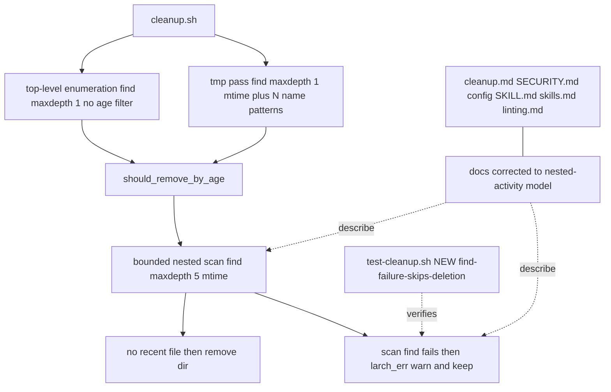

## Architecture Diagram

```mermaid
graph TD
    A[cleanup.sh] --> B[top-level enumeration find maxdepth 1 no age filter]
    A --> T[tmp pass find maxdepth 1 mtime plus N name patterns]
    B --> C[should_remove_by_age]
    T --> C
    C --> D[bounded nested scan find maxdepth 5 mtime]
    D --> E[no recent file then remove dir]
    D --> F[scan find fails then larch_err warn and keep]
    G[test-cleanup.sh NEW find-failure-skips-deletion] -.verifies.-> F
    H[docs corrected to nested-activity model] -.describe.-> D
    H -.describe.-> F
    H2[cleanup.md SECURITY.md config SKILL.md skills.md linting.md] --- H
```
