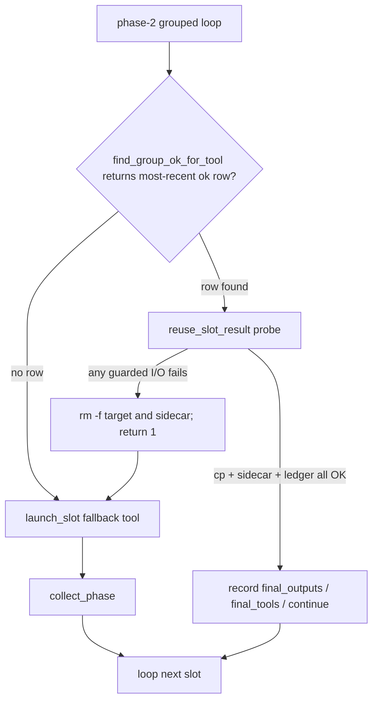

## Architecture Diagram

```mermaid
flowchart TD
    A[phase-2 grouped loop] --> B{find_group_ok_for_tool returns most-recent ok row?}
    B -->|no row| C[launch_slot fallback tool]
    B -->|row found| D[reuse_slot_result probe]
    D -->|cp + sidecar + ledger all OK| E[record final_outputs / final_tools / continue]
    D -->|any guarded I/O fails| F[rm -f target and sidecar; return 1]
    F --> C
    C --> G[collect_phase]
    G --> H[loop next slot]
    E --> H
```
