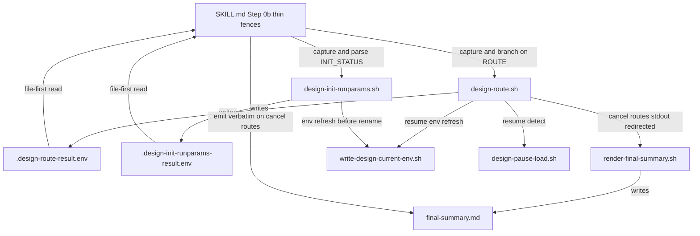

## Architecture Diagram

```mermaid
graph TD
    Orchestrator["SKILL.md Step 0b thin fences"]
    RouteDriver["design-route.sh"]
    InitDriver["design-init-runparams.sh"]
    RouteEnv[".design-route-result.env"]
    InitEnv[".design-init-runparams-result.env"]
    RenderSummary["render-final-summary.sh"]
    WriteEnv["write-design-current-env.sh"]
    PauseLoad["design-pause-load.sh"]
    FinalSummary["final-summary.md"]

    Orchestrator -->|capture and branch on ROUTE| RouteDriver
    Orchestrator -->|capture and parse INIT_STATUS| InitDriver
    RouteDriver -->|writes| RouteEnv
    InitDriver -->|writes| InitEnv
    RouteEnv -->|file-first read| Orchestrator
    InitEnv -->|file-first read| Orchestrator
    RouteDriver -->|cancel routes stdout redirected| RenderSummary
    RouteDriver -->|resume env refresh| WriteEnv
    RouteDriver -->|resume detect| PauseLoad
    InitDriver -->|env refresh before rename| WriteEnv
    RenderSummary -->|writes| FinalSummary
    Orchestrator -->|emit verbatim on cancel routes| FinalSummary
```
