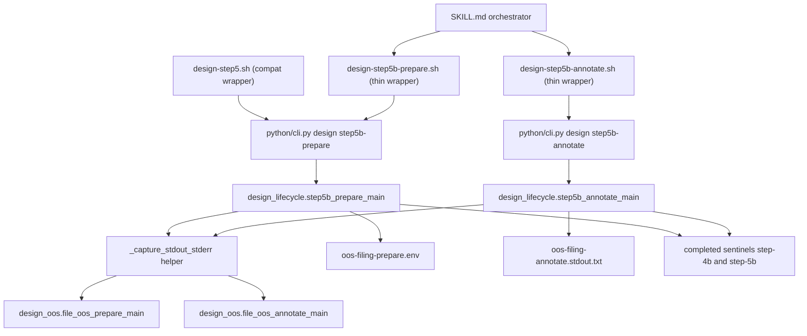

## Architecture Diagram

```mermaid
graph TD
    A["SKILL.md orchestrator"] --> B["design-step5b-prepare.sh (thin wrapper)"]
    A --> C["design-step5b-annotate.sh (thin wrapper)"]
    D["design-step5.sh (compat wrapper)"] --> E["python/cli.py design step5b-prepare"]
    B --> E
    C --> F["python/cli.py design step5b-annotate"]
    E --> G["design_lifecycle.step5b_prepare_main"]
    F --> H["design_lifecycle.step5b_annotate_main"]
    G --> I["_capture_stdout_stderr helper"]
    H --> I
    I --> J["design_oos.file_oos_prepare_main"]
    I --> K["design_oos.file_oos_annotate_main"]
    G --> L["oos-filing-prepare.env"]
    H --> M["oos-filing-annotate.stdout.txt"]
    G --> N["completed sentinels step-4b and step-5b"]
    H --> N
```
